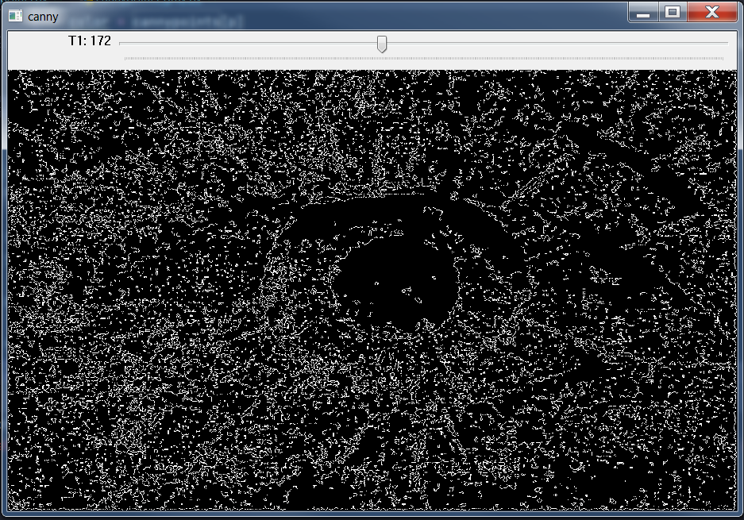

# Detecção de Bordas

## Requisitos
- Python 3.8
- OpenCV 4.5.3
- Numpy

## 8.3 Exercícios
- Utilizando os programas exemplos/canny.cpp e exemplos/pontilhismo.cpp como referência, implemente um programa cannypoints.cpp. A idéia é usar as bordas produzidas pelo algoritmo de Canny para melhorar a qualidade da imagem pontilhista gerada. A forma como a informação de borda será usada é livre. Entretanto, são apresentadas algumas sugestões de técnicas que poderiam ser utilizadas:

    - Desenhar pontos grandes na imagem pontilhista básica;

    - Usar a posição dos pixels de borda encontrados pelo algoritmo de Canny para desenhar pontos nos respectivos locais na imagem gerada.

    - Experimente ir aumentando os limiares do algoritmo de Canny e, para cada novo par de limiares, desenhar círculos cada vez menores nas posições encontradas. A Figura 19 foi desenvolvida usando essa técnica.

- Escolha uma imagem de seu gosto e aplique a técnica que você desenvolveu.

- Descreva no seu relatório detalhes do procedimento usado para criar sua técnica pontilhista.


## Programa cannypoints.py
Desenvolvido em Python

## Descrição
- A técnica utilizada consiste em reconstruir, ou melhorar uma imagem pontilhada. Como não temos uma imagem pontilhada, o programa descrito abaixo primeiro cria uma imagem pontilhada, podendo ser colorida executando o programa cannypoint.py, ou pode se em tons de cinza executando o programa cannypoints_gray.py. O resultado é uma imagem pontilhada, suas características podem ter algumas variações dependendo dos valores à serem carregados nas variáveis STEP, JITTER e RAIO. A alteração destes valores precisa ser sutil, pois grandes alterações geram uma imagem pontilhada quase que impossível de ser reconstruída ou melhorada, portanto, não foi criada Trackbar para controle destas variáveis, tendo o controle apenas dentro do código fonte. A variável STEP indica para o programa quantos pixels devem ser "escolhidos" para o espaço de criação de um ponto. A variável JITTER indica para o programa qual o desvio aleatório necessário de deslocamento do centro do ponto. A variável RAIO indica para o programa qual o valor do raio a ser utilizado na construção do ponto.
- A partir da imagem pontilhada, o programa usa esta imagem para obter uma imagem apenas com as bordas, utilizando a função cv2.canny(). Como parâmetro para controlar a detecção das bordas, é utilizado a variável T1, esta variável recebe valores da Trackbar, para obter o melhor resultado de bordas da imagem.
- Tendo a imagem pontilhada e a imagem das bordas, o próximo passo é percorrer a imagem das bordas "canny", e para cada posição da imagem que for diferente de zero, é buscado a cor na mesma posição da imagem pontilhada e desenhado um círculo menor para recompor a imagem, melhorando-a, até obter um resultado satisfatório, salvando em um arquivo chamado de cannypoints.png.

## Exemplos de entrada e saída

Imagem original          |     Points               |    Canny                |      Cannypoints
:-----------------------:|:------------------------:|:-----------------------:|:------------------------------:
  |   |   | 

Imagem original          |     Points               |    Canny                |      Cannypoints
:-----------------------:|:------------------------:|:-----------------------:|:------------------------------:
  |   |   | 

Imagem original          |     Points               |    Canny                |      Cannypoints
:-----------------------:|:------------------------:|:-----------------------:|:------------------------------:
  |   |   | 

Imagem original          |     Points               |    Canny                |      Cannypoints
:-----------------------:|:------------------------:|:-----------------------:|:------------------------------:
  |   |   | 

Imagem original          |     Points               |    Canny                |      Cannypoints
:-----------------------:|:------------------------:|:-----------------------:|:------------------------------:
  |   |   | 

Imagem original          |     Points               |    Canny                |      Cannypoints
:-----------------------:|:------------------------:|:-----------------------:|:------------------------------:
  |   |   | 

Imagem original          |     Points               |    Canny                |      Cannypoints
:-----------------------:|:------------------------:|:-----------------------:|:------------------------------:
  |   |   | 

Imagem original          |     Points               |    Canny                |      Cannypoints
:-----------------------:|:------------------------:|:-----------------------:|:------------------------------:
  |   |   | 

Imagem original          |     Points               |    Canny                |      Cannypoints
:-----------------------:|:------------------------:|:-----------------------:|:------------------------------:
  |   |   | 

Imagem original          |     Points               |    Canny                |      Cannypoints
:-----------------------:|:------------------------:|:-----------------------:|:------------------------------:
  |   |   | 
    
    
# Funcionamento do código

Importação das bibliotecas.
```
import cv2
import numpy as np
```
\
Configuração da Trackbar, onde o usuário poderá configurar a variável T1, que corresponde a detecção das bordas da função canny.
```
TOP_SLIDER = 10
TOP_SLIDER_MAX = 400
T1 = 10
```
\
Configuração dos pixels, desvio aleatório e raio para a construção dos pontos na imagem.
```
STEP = 5
JITTER = 3
RAIO = 3
```
\
## Função Trackbar
Função que configura a variável T1 da Trackbar.
```
def setT1(t1):
```
\
Tornando as variáveis T1 e points globais e passando como argumento o valor da variável da Trackbar T1 para controle interno da função.
```
    global T1, points
    T1 = t1
```
\
Função que detecta as bordas da imagem, de acordo com a variável T1.
```
    edges = cv2.Canny(points, T1, 3 * T1)
```
\
Mostra a imagem das bordas e salva esta imegame em arquivo.
```
    cv2.imshow("canny", edges)
    cv2.imwrite("output/canny.png", edges)
```
\
Realiza a cópia para melhor ajuste da imagem.
```
    cannypoints = points.copy()
```
\
Verifica através da função do Numpy, as posições que forem diferentes de zero, se for verdadeirto é porque há borda detectada, então estas posições são salvas em uma variável com os valores filtrados.
```
    edges_filter = np.where(edges != 0)
```
\
Para cada posição das bordas, as informações são unidas em uma variável chamada coordinates.
```
    coordinates = zip(edges_filter[0], edges_filter[1])
```
\
Para cada coordenada das bordas, é buscado a cor correspondente na mesma posição da imagem pontilhada, e depois desenhado um círculo na nova imagem gerada, melhorada, passando como argumentos a imagem pontilhada, as coordenadas, o raio do círculo e as cores da imagem.
```
    for p in coordinates:
        color = cannypoints[p]
        cv2.circle(cannypoints, (p[1], p[0]), RAIO//2, (int(color[0]), int(color[1]), int(color[2])), -1, cv2.LINE_AA)
```
\
Neste ponto, é mostrado a imagem melhorada, e também salvo em arquivo.
```
    cv2.imshow("cannypoints", cannypoints)
    cv2.imwrite("output/cannypoints.png", cannypoints)
```
\
## Entrypoint do programa
Entrypoint do programa, onde a imagem é carregada.
```
image = cv2.imread("resources/img1.png", cv2.IMREAD_COLOR)
```
\
Reconhecimento da altura e largura da imagem.
```
height, width = image.shape[:2]
```
\
Criação dos ranges para os espaços dos círculos.
```
xrange = np.arange(0, image.shape[0] - STEP, STEP) + STEP // 2
yrange = np.arange(0, image.shape[1] - STEP, STEP) + STEP // 2
```
\
Criação de uma imagem matriz com zeros para receber os círculos/pontos.
```
points = np.zeros(image.shape, dtype=np.uint8)
```
\
Criação dos pontos aleatórios a partir dos pixels da imagem original carregada, em cima da imagem matriz com zeros.
```
np.random.shuffle(xrange)
for i in xrange:
    np.random.shuffle(yrange)
    for j in yrange:
        x = i + np.random.randint((2 * JITTER) - JITTER + 1)
        y = j + np.random.randint((2 * JITTER) - JITTER + 1)
        color = image[x, y]
        cv2.circle(points, (y, x), RAIO, (int(color[0]), int(color[1]), int(color[2])), -1, cv2.LINE_AA)
```
\
Mostra a imagem pontilhada e salva em arquivo.
```
cv2.imshow("points", points)
cv2.imwrite("output/points.png", points)
```
\
Cria uma janela chamada de canny, com uma Trackbar para controle da variável T1, para a detecção de bordas.
```
cv2.namedWindow("canny", cv2.WINDOW_GUI_NORMAL)
cv2.createTrackbar("T1", "canny", TOP_SLIDER, TOP_SLIDER_MAX, setT1)
```
\
Aguarda uma tecla ser pressionada para encerrar a execução do programa.
```
cv2.waitKey(0)
cv2.destroyAllWindows()
```


## Conclusão
O programa consegue melhorar as imagens pontilhadas, no entanto, é preciso atenção na escolha dos valores das variáveis STEP, JITTER e RAIO, pois valores muito altos demonstram incapacidade do programa de recuperar a imagem pontilhada, a preferência é por valores baixos, no máximo até cinco para obter resultados razoéveis.


## Código final completo em Python
```
import cv2
import numpy as np

TOP_SLIDER = 10
TOP_SLIDER_MAX = 400
T1 = 10

STEP = 5
JITTER = 3
RAIO = 3


def setT1(t1):
    global T1, points
    T1 = t1
    edges = cv2.Canny(points, T1, 3 * T1)
    cv2.imshow("canny", edges)
    cv2.imwrite("output/canny.png", edges)

    cannypoints = points.copy()

    edges_filter = np.where(edges != 0)
    coordinates = zip(edges_filter[0], edges_filter[1])
    for p in coordinates:
        color = cannypoints[p]
        cv2.circle(cannypoints, (p[1], p[0]), RAIO//2, (int(color[0]), int(color[1]), int(color[2])), -1, cv2.LINE_AA)

    cv2.imshow("cannypoints", cannypoints)
    cv2.imwrite("output/cannypoints.png", cannypoints)


image = cv2.imread("resources/img1.png", cv2.IMREAD_COLOR)
height, width = image.shape[:2]

xrange = np.arange(0, image.shape[0] - STEP, STEP) + STEP // 2
yrange = np.arange(0, image.shape[1] - STEP, STEP) + STEP // 2

points = np.zeros(image.shape, dtype=np.uint8)

np.random.shuffle(xrange)
for i in xrange:
    np.random.shuffle(yrange)
    for j in yrange:
        x = i + np.random.randint((2 * JITTER) - JITTER + 1)
        y = j + np.random.randint((2 * JITTER) - JITTER + 1)
        color = image[x, y]
        cv2.circle(points, (y, x), RAIO, (int(color[0]), int(color[1]), int(color[2])), -1, cv2.LINE_AA)

cv2.imshow("points", points)
cv2.imwrite("output/points.png", points)

cv2.namedWindow("canny", cv2.WINDOW_GUI_NORMAL)
cv2.createTrackbar("T1", "canny", TOP_SLIDER, TOP_SLIDER_MAX, setT1)

cv2.waitKey(0)
cv2.destroyAllWindows()
```
-------------------------------------------------------

## Código do exemplo em C++
canny.cpp
```
#include <iostream>
#include "opencv2/opencv.hpp"

using namespace std;
using namespace cv;

int top_slider = 10;
int top_slider_max = 200;

char TrackbarName[50];

Mat image, border;

void on_trackbar_canny(int, void*){
  Canny(image, border, top_slider, 3*top_slider);
  imshow("canny", border);
}

int main(int argc, char**argv){
  int width, height;

  image= imread(argv[1],CV_LOAD_IMAGE_GRAYSCALE);

  width=image.size().width;
  height=image.size().height;

  sprintf( TrackbarName, "Threshold inferior", top_slider_max );

  namedWindow("canny",1);
  createTrackbar( TrackbarName, "canny",
                &top_slider,
                top_slider_max,
                on_trackbar_canny );

  on_trackbar_canny(top_slider, 0 );

  waitKey();
  imwrite("cannyborders.png", border);
  return 0;
}

```
\
pontilhismo.cpp
```
#include <iostream>
#include <opencv2/opencv.hpp>
#include <fstream>
#include <iomanip>
#include <vector>
#include <algorithm>
#include <numeric>
#include <ctime>
#include <cstdlib>

using namespace std;
using namespace cv;

#define STEP 5
#define JITTER 3
#define RAIO 3

int main(int argc, char** argv){
  vector<int> yrange;
  vector<int> xrange;

  Mat image, frame, points;

  int width, height, gray;
  int x, y;

  image= imread(argv[1],CV_LOAD_IMAGE_GRAYSCALE);

  srand(time(0));

  if(!image.data){
	cout << "nao abriu" << argv[1] << endl;
    cout << argv[0] << " imagem.jpg";
    exit(0);
  }

  width=image.size().width;
  height=image.size().height;

  xrange.resize(height/STEP);
  yrange.resize(width/STEP);

  iota(xrange.begin(), xrange.end(), 0);
  iota(yrange.begin(), yrange.end(), 0);

  for(uint i=0; i<xrange.size(); i++){
    xrange[i]= xrange[i]*STEP+STEP/2;
  }

  for(uint i=0; i<yrange.size(); i++){
    yrange[i]= yrange[i]*STEP+STEP/2;
  }

  points = Mat(height, width, CV_8U, Scalar(255));

  random_shuffle(xrange.begin(), xrange.end());

  for(auto i : xrange){
    random_shuffle(yrange.begin(), yrange.end());
    for(auto j : yrange){
      x = i+rand()%(2*JITTER)-JITTER+1;
      y = j+rand()%(2*JITTER)-JITTER+1;
      gray = image.at<uchar>(x,y);
      circle(points,
             cv::Point(y,x),
             RAIO,
             CV_RGB(gray,gray,gray),
             -1,
             CV_AA);
    }
  }
  imwrite("pontos.jpg", points);
  return 0;
}
```
