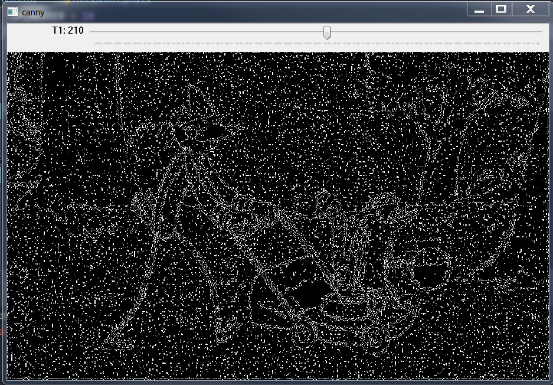
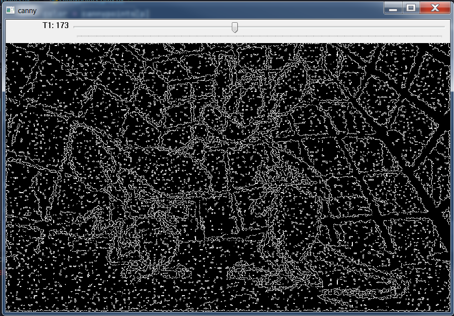
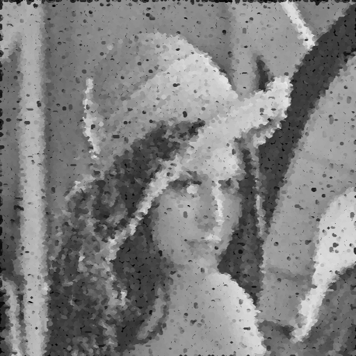

# Detecção de Bordas

## Requisitos
- Python 3.8
- OpenCV 4.5.3
- Numpy

## 8.3 Exercícios
- Utilizando os programas exemplos/canny.cpp e exemplos/pontilhismo.cpp como referência, implemente um programa cannypoints.cpp. A idéia é usar as bordas produzidas pelo algoritmo de Canny para melhorar a qualidade da imagem pontilhista gerada. A forma como a informação de borda será usada é livre. Entretanto, são apresentadas algumas sugestões de técnicas que poderiam ser utilizadas:

    - Desenhar pontos grandes na imagem pontilhista básica;

    - Usar a posição dos pixels de borda encontrados pelo algoritmo de Canny para desenhar pontos nos respectivos locais na imagem gerada.

    - Experimente ir aumentando os limiares do algoritmo de Canny e, para cada novo par de limiares, desenhar círculos cada vez menores nas posições encontradas. A Figura 19 foi desenvolvida usando essa técnica.

- Escolha uma imagem de seu gosto e aplique a técnica que você desenvolveu.

- Descreva no seu relatório detalhes do procedimento usado para criar sua técnica pontilhista.


## Programa cannypoints.py
Desenvolvido em Python


## Exemplos de entrada e saída

Imagem original          |     Points               |    Canny                |      Cannypoints
:-----------------------:|:------------------------:|:-----------------------:|:------------------------------:
  |   |   | 

Imagem original          |     Points               |    Canny                |      Cannypoints
:-----------------------:|:------------------------:|:-----------------------:|:------------------------------:
  |   |   | 

Imagem original          |     Points               |    Canny                |      Cannypoints
:-----------------------:|:------------------------:|:-----------------------:|:------------------------------:
  |   |   | 

Imagem original          |     Points               |    Canny                |      Cannypoints
:-----------------------:|:------------------------:|:-----------------------:|:------------------------------:
  |   |   | 

Imagem original          |     Points               |    Canny                |      Cannypoints
:-----------------------:|:------------------------:|:-----------------------:|:------------------------------:
  |   |   | 

Imagem original          |     Points               |    Canny                |      Cannypoints
:-----------------------:|:------------------------:|:-----------------------:|:------------------------------:
  |   |   | 

Imagem original          |     Points               |    Canny                |      Cannypoints
:-----------------------:|:------------------------:|:-----------------------:|:------------------------------:
  |   |   | 

Imagem original          |     Points               |    Canny                |      Cannypoints
:-----------------------:|:------------------------:|:-----------------------:|:------------------------------:
  |   |   | 

Imagem original          |     Points               |    Canny                |      Cannypoints
:-----------------------:|:------------------------:|:-----------------------:|:------------------------------:
  |   |   | 

Imagem original          |     Points               |    Canny                |      Cannypoints
:-----------------------:|:------------------------:|:-----------------------:|:------------------------------:
  |   |   | 
    
    
# Diagrama 


# Funcionamento do código

Importação das bibliotecas.
```
import cv2
import numpy as np
from math import exp, sqrt
```
\


## Conclusão
O programa consegue filtrar as baixas e altas frequências, apresentando resultados diferentes para as imagens dependendo da forma como a cena está iluminada, da posição e quantidade de luz. Algumas cenas conseguimos filtrar, mostrando quase todos os detalhes que estavam na escuridão.


## Código final completo em Python
```
import cv2
import numpy as np

TOP_SLIDER = 100
TOP_SLIDER_MAX = 200
T1 = 10
edges = 0

STEP = 5
JITTER = 3
RAIO = 3


def setT1(t1):
    global T1, height, width, edges, points, image
    T1 = t1
    edges = cv2.Canny(image, T1, 3 * T1)
    cv2.imshow("canny", edges)
    cv2.imwrite("output/canny.png", edges)

    cannypoints = points.copy()
    """    
    for i in range(height):
        for j in range(width):
            if edges[i, j] != 0:
                color = image[i, j]
                cv2.circle(cannypoints, (j, i), RAIO, (int(color[0]), int(color[1]), int(color[2])), -1, cv2.LINE_AA)
    """
    edges_filter = np.where(edges != 0)
    coordinates = zip(edges_filter[0], edges_filter[1])
    for p in coordinates:
        color = image[p]
        cv2.circle(cannypoints, (p[1], p[0]), RAIO, (int(color[0]), int(color[1]), int(color[2])), -1, cv2.LINE_AA)

    cv2.imshow("cannypoints", cannypoints)
    cv2.imwrite("output/cannypoints.png", cannypoints)


image = cv2.imread("resources/img1.png", cv2.IMREAD_COLOR)
height, width = image.shape[:2]

xrange = np.arange(0, image.shape[0] - STEP, STEP) + STEP // 2
yrange = np.arange(0, image.shape[1] - STEP, STEP) + STEP // 2

points = np.zeros(image.shape, dtype=np.uint8)

np.random.shuffle(xrange)

for i in xrange:
    np.random.shuffle(yrange)
    for j in yrange:
        x = i + np.random.randint((2 * JITTER) - JITTER + 1)
        y = j + np.random.randint((2 * JITTER) - JITTER + 1)
        color = image[x, y]
        cv2.circle(points, (y, x), RAIO, (int(color[0]), int(color[1]), int(color[2])), -1, cv2.LINE_AA)

cv2.imshow("points", points)
cv2.imwrite("output/points.png", points)

cv2.namedWindow("canny", cv2.WINDOW_GUI_NORMAL)
cv2.createTrackbar("T1", "canny", TOP_SLIDER, TOP_SLIDER_MAX, setT1)

cv2.waitKey(0)
cv2.destroyAllWindows()


```
-------------------------------------------------------

## Código do exemplo em C++
canny.cpp
```
#include <iostream>
#include "opencv2/opencv.hpp"

using namespace std;
using namespace cv;

int top_slider = 10;
int top_slider_max = 200;

char TrackbarName[50];

Mat image, border;

void on_trackbar_canny(int, void*){
  Canny(image, border, top_slider, 3*top_slider);
  imshow("canny", border);
}

int main(int argc, char**argv){
  int width, height;

  image= imread(argv[1],CV_LOAD_IMAGE_GRAYSCALE);

  width=image.size().width;
  height=image.size().height;

  sprintf( TrackbarName, "Threshold inferior", top_slider_max );

  namedWindow("canny",1);
  createTrackbar( TrackbarName, "canny",
                &top_slider,
                top_slider_max,
                on_trackbar_canny );

  on_trackbar_canny(top_slider, 0 );

  waitKey();
  imwrite("cannyborders.png", border);
  return 0;
}

```
\
pontilhismo.cpp
```
#include <iostream>
#include <opencv2/opencv.hpp>
#include <fstream>
#include <iomanip>
#include <vector>
#include <algorithm>
#include <numeric>
#include <ctime>
#include <cstdlib>

using namespace std;
using namespace cv;

#define STEP 5
#define JITTER 3
#define RAIO 3

int main(int argc, char** argv){
  vector<int> yrange;
  vector<int> xrange;

  Mat image, frame, points;

  int width, height, gray;
  int x, y;

  image= imread(argv[1],CV_LOAD_IMAGE_GRAYSCALE);

  srand(time(0));

  if(!image.data){
	cout << "nao abriu" << argv[1] << endl;
    cout << argv[0] << " imagem.jpg";
    exit(0);
  }

  width=image.size().width;
  height=image.size().height;

  xrange.resize(height/STEP);
  yrange.resize(width/STEP);

  iota(xrange.begin(), xrange.end(), 0);
  iota(yrange.begin(), yrange.end(), 0);

  for(uint i=0; i<xrange.size(); i++){
    xrange[i]= xrange[i]*STEP+STEP/2;
  }

  for(uint i=0; i<yrange.size(); i++){
    yrange[i]= yrange[i]*STEP+STEP/2;
  }

  points = Mat(height, width, CV_8U, Scalar(255));

  random_shuffle(xrange.begin(), xrange.end());

  for(auto i : xrange){
    random_shuffle(yrange.begin(), yrange.end());
    for(auto j : yrange){
      x = i+rand()%(2*JITTER)-JITTER+1;
      y = j+rand()%(2*JITTER)-JITTER+1;
      gray = image.at<uchar>(x,y);
      circle(points,
             cv::Point(y,x),
             RAIO,
             CV_RGB(gray,gray,gray),
             -1,
             CV_AA);
    }
  }
  imwrite("pontos.jpg", points);
  return 0;
}
```
