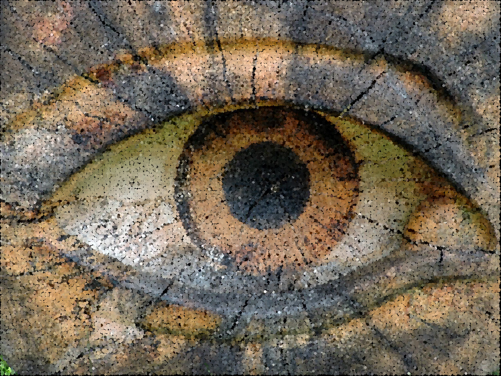

# Detecção de Bordas

## Requisitos
- Python 3.8
- OpenCV 4.5.3
- Numpy

## 8.3 Exercícios
- Utilizando os programas exemplos/canny.cpp e exemplos/pontilhismo.cpp como referência, implemente um programa cannypoints.cpp. A idéia é usar as bordas produzidas pelo algoritmo de Canny para melhorar a qualidade da imagem pontilhista gerada. A forma como a informação de borda será usada é livre. Entretanto, são apresentadas algumas sugestões de técnicas que poderiam ser utilizadas:

    - Desenhar pontos grandes na imagem pontilhista básica;

    - Usar a posição dos pixels de borda encontrados pelo algoritmo de Canny para desenhar pontos nos respectivos locais na imagem gerada.

    - Experimente ir aumentando os limiares do algoritmo de Canny e, para cada novo par de limiares, desenhar círculos cada vez menores nas posições encontradas. A Figura 19 foi desenvolvida usando essa técnica.

- Escolha uma imagem de seu gosto e aplique a técnica que você desenvolveu.

- Descreva no seu relatório detalhes do procedimento usado para criar sua técnica pontilhista.


## Programa cannypoints.py
Desenvolvido em Python


## Exemplos de entrada e saída

Imagem original          |     Points               |    Canny            |      Cannypoints
:-----------------------:|:------------------------:|:-------------------:|:------------------------------:
  |   |   | 

Imagem original          |     Points               |    Canny            |      Cannypoints
:-----------------------:|:------------------------:|:-------------------:|:------------------------------:
  |   |   | 

Imagem original          |     Points               |    Canny            |      Cannypoints
:-----------------------:|:------------------------:|:-------------------:|:------------------------------:
  |   |   | 

Imagem original          |     Points               |    Canny            |      Cannypoints
:-----------------------:|:------------------------:|:-------------------:|:------------------------------:
  |   |   | 

Imagem original          |     Points               |    Canny            |      Cannypoints
:-----------------------:|:------------------------:|:-------------------:|:------------------------------:
  |   |   | 


# Diagrama 


# Funcionamento do código

Importação das bibliotecas.
```
import cv2
import numpy as np
from math import exp, sqrt
```
\


## Conclusão
O programa consegue filtrar as baixas e altas frequências, apresentando resultados diferentes para as imagens dependendo da forma como a cena está iluminada, da posição e quantidade de luz. Algumas cenas conseguimos filtrar, mostrando quase todos os detalhes que estavam na escuridão.


## Código final completo em Python
```


```
-------------------------------------------------------

## Código do exemplo em C++
```


```
