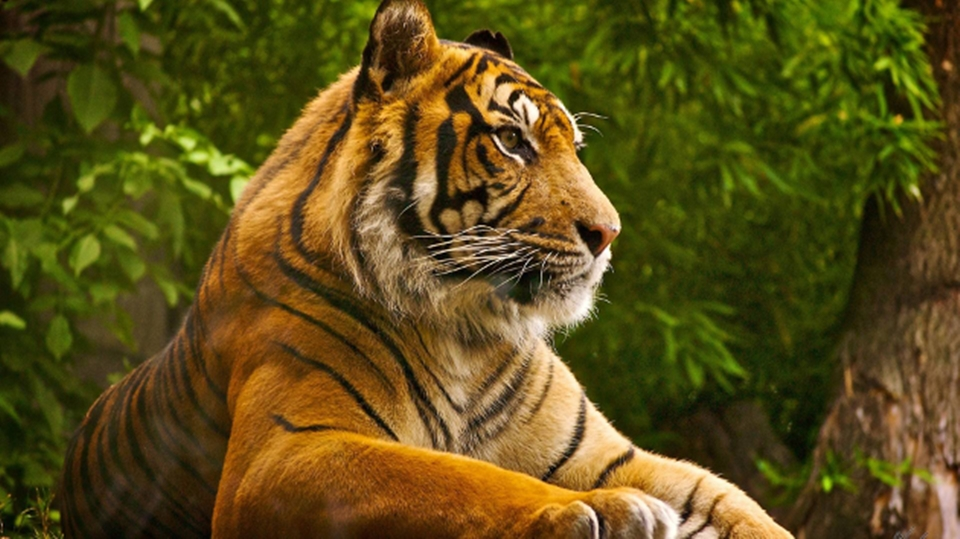
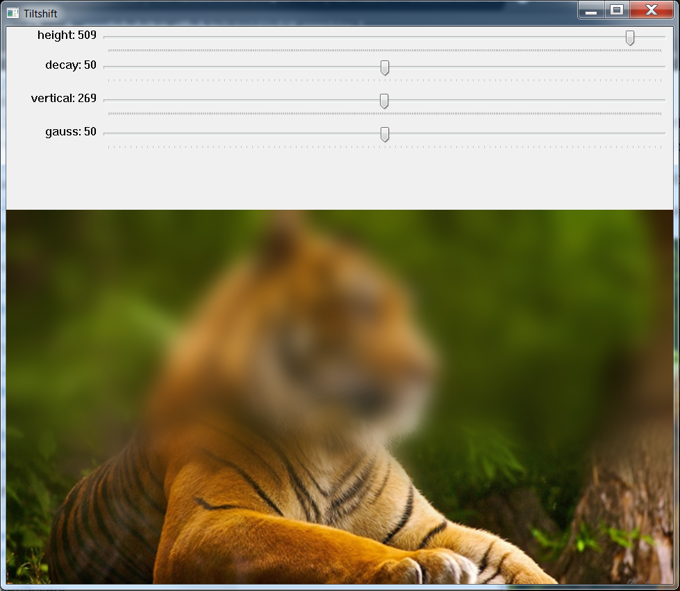
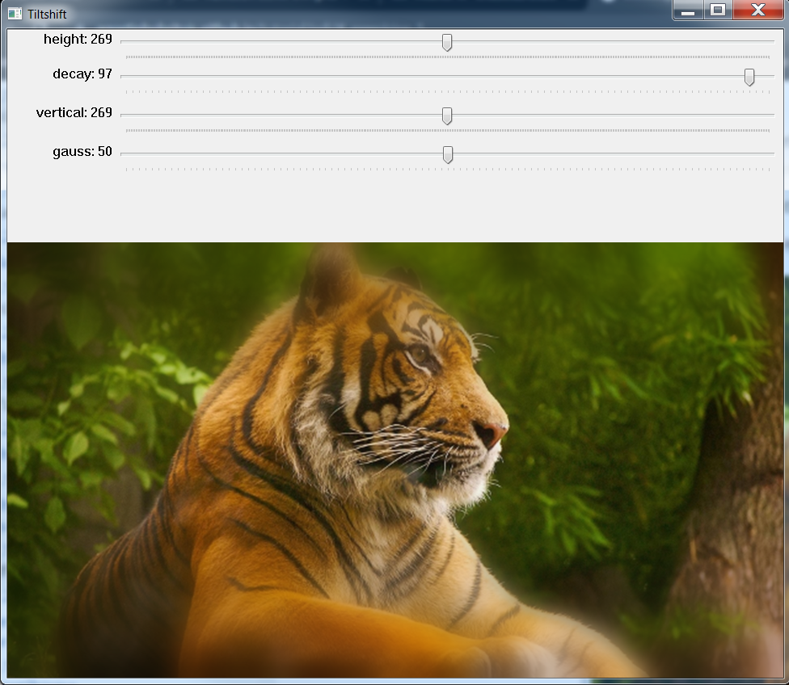
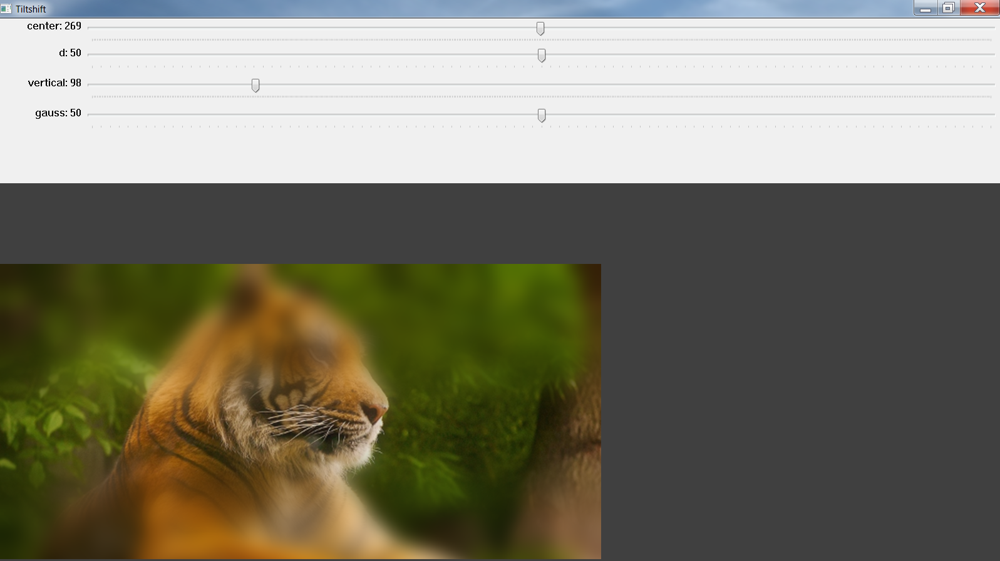
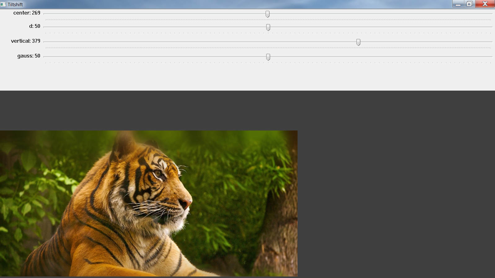
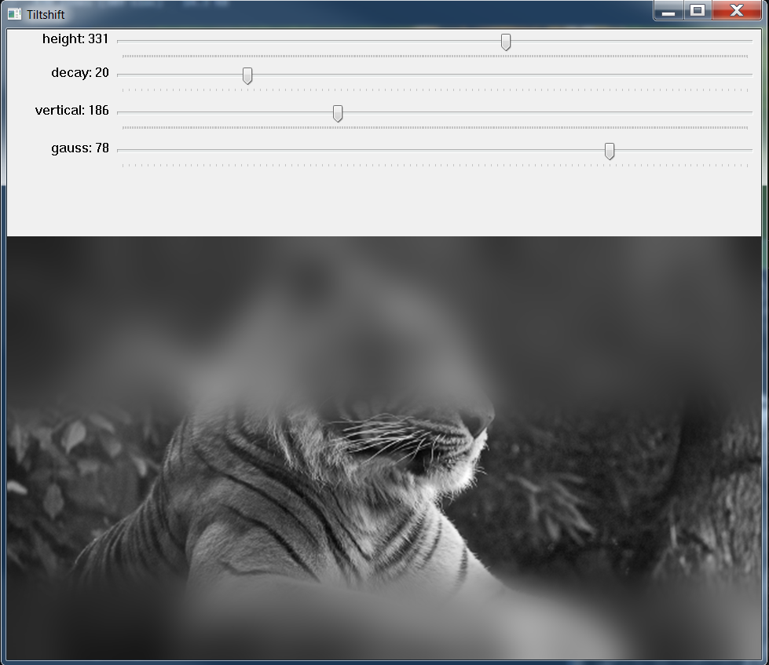
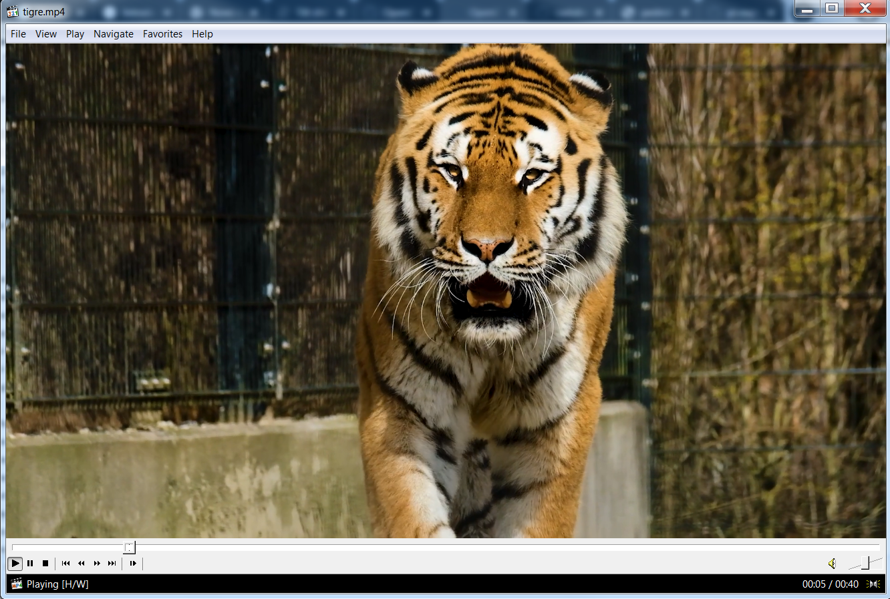
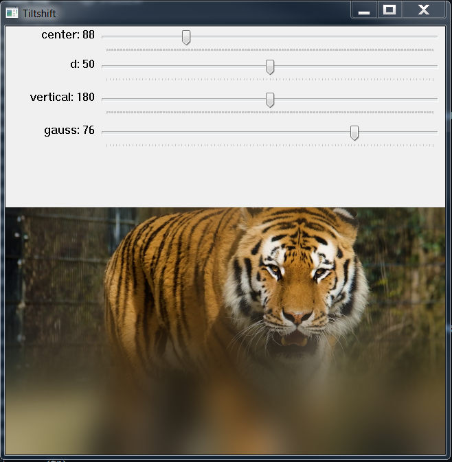
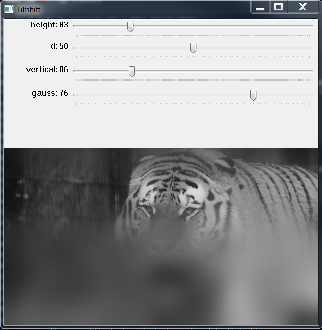

# Filtragem Espacial II

## Requisitos
- Python 3.8
- OpenCV 4.5.3
- Numpy

## 6.1 Exercícios
- Utilizando o programa exemplos/addweighted.cpp como referência, implemente um programa tiltshift.cpp. Três ajustes deverão ser providos na tela da interface:

  - um ajuste para regular a altura da região central que entrará em foco;

  - um ajuste para regular a força de decaimento da região borrada;

  - um ajuste para regular a posição vertical do centro da região que entrará em foco. Finalizado o programa, a imagem produzida deverá ser salva em arquivo.

- Utilizando o programa exemplos/addweighted.cpp como referência, implemente um programa tiltshiftvideo.cpp. Tal programa deverá ser capaz de processar um arquivo de vídeo, produzir o efeito de tilt-shift nos quadros presentes e escrever o resultado em outro arquivo de vídeo. A ideia é criar um efeito de miniaturização de cenas. Descarte quadros em uma taxa que julgar conveniente para evidenciar o efeito de stop motion, comum em vídeos desse tipo.

# Programa tiltshift.py
Desenvolvido em Python

## Exemplos de entrada e saída

<table>
    <tr>
        <th align="Center">Imagem como exemplo de entrada</th>
    </tr> 
    <tr>
        <td>
            
        </td>
    </tr>
    <tr>
        <td>Imagem de entrada para o programa, sem edições.</td>
    </tr>
</table>
<br>
<table>
    <tr>
        <th align="Center">Iniciando o programa</th>
    </tr> 
    <tr>
        <td>
            
        </td>
    </tr>
    <tr>
        <td>Início da execução do programa, imagem carregada colorida</td>
    </tr>
</table>
<br>
<table>
    <tr>
        <th align="Center">Programa carregado</th>
    </tr> 
    <tr>
        <td>
            
        </td>
    </tr>
    <tr>
        <td>Início do tratamento da imagem, todas as opções de configuração estão exatamente na metade, já é possível notar os efeitos produzidos.</td>
    </tr>
</table>
<br>
<table>
    <tr>
        <th align="Center">Ajuste para regular a altura da região central que entrará em foco</th>
    </tr> 
    <tr>
        <td>
            
        </td>
    </tr>
    <tr>
        <td>Diminuição da altura da região central que entrará em foco.</td>
    </tr>
</table>
<br>
<table>
    <tr>
        <th align="Center">Ajuste para regular a altura da região central que entrará em foco</th>
    </tr> 
    <tr>
        <td>
            
        </td>
    </tr>
    <tr>
        <td>Aumento da altura da região central que entrará em foco.</td>
    </tr>
</table>
<br>
<table>
    <tr>
        <th align="Center">Ajuste para regular a força de decaimento da região borrada</th>
    </tr> 
    <tr>
        <td>
            
        </td>
    </tr>
    <tr>
        <td>Diminuição da força de decaimento da região borrada.</td>
    </tr>
</table>
<br>
<table>
    <tr>
        <th align="Center">Ajuste para regular a força de decaimento da região borrada</th>
    </tr> 
    <tr>
        <td>
            
        </td>
    </tr>
    <tr>
        <td>Aumento da força de decaimento da região borrada.</td>
    </tr>
</table>
<br>
<table>
    <tr>
        <th align="Center">Ajuste para regular a posição vertical do centro da região que entrará em foco</th>
    </tr> 
    <tr>
        <td>
            
        </td>
    </tr>
    <tr>
        <td>Diminuição da posição vertical do centro da região que entrará em foco..</td>
    </tr>
</table>
<br>
<table>
    <tr>
        <th align="Center">Ajuste para regular a posição vertical do centro da região que entrará em foco</th>
    </tr> 
    <tr>
        <td>
            
        </td>
    </tr>
    <tr>
        <td>Aumento da posição vertical do centro da região que entrará em foco..</td>
    </tr>
</table>
<br>
<table>
    <tr>
        <th align="Center">Imagem produzida salva em arquivo</th>
    </tr> 
    <tr>
        <td>
            
        </td>
    </tr>
    <tr>
        <td>Aumento da posição vertical do centro da região que entrará em foco.</td>
    </tr>
</table>
<br>
<table>
    <tr>
        <th align="Center">Exemplo dos efeitos em uma imagem com tons de cinza</th>
    </tr> 
    <tr>
        <td>
            
        </td>
    </tr>
    <tr>
        <td>usando a linha de comando 'python tiltshift.py --color gray' sem as aspas.</td>
    </tr>
</table>
<br>

## Funcionamento do código

Importação das bibliotecas.
```
import cv2
import numpy as np
import argparse
```
\
Se o programa for executado em linha de comando, poderá ser passado um argumento opcional para carregar a imagem colorida ou em tons de cinza.\
Usando a linha de comando ```python tiltshift.py --color rgb``` a imagem carregada será colorida, podendo ser observado os efeitos nesta imagem.\
Usando a linha de comando ```python tiltshift.py --color gray``` a imagem carregada será transformada para tons de cinza, podendo também ser observado os efeitos nesta imagem.\
Se apenas usar a linha de comando ```python tiltshift.py```, por padrão a imagem carregada será colorida.

```
parser = argparse.ArgumentParser()
parser.add_argument('-c', '--color', type=str, default='rgb',
    help='Color space: "rgb" (default), "gray"')
args = vars(parser.parse_args())
```
\
Realiza a leitura da imagem em arquivo, e testa se o argumento passado no parser é 'rgb' ou 'gray', a imagem é carregada colorida ou em tons de cinza conforme este argumento.
```
image = cv2.imread('resources/image.png')
if args['color'] == 'rgb':
    image = cv2.cvtColor(image, cv2.IMREAD_COLOR)
elif args['color'] == 'gray':
    image = cv2.cvtColor(image, cv2.COLOR_BGR2GRAY)
```
\
Identifica a altura e a largura da imagem, atribuindo estas informações para duas variáveis.
```
height, weigth = image.shape[:2]
```
\
Cria uma janela e mostra a imagem original nesta janela.
```
cv2.namedWindow('Original')
cv2.imshow('Original', image)
```
\
Cria uma janela para mostrar a imagem com os efeitos tiltshift.
```
cv2.namedWindow('Tiltshift')
```
\
Cria quatro Trackbar, que são uma forma de modificar algum parâmetro na imagem.\
Recebe como argumentos:
- O nome da Trackbar
- A janela para o qual será inserida este Trackbar
- O valor inicial sendo que o valor mínimo é zero
- O valor máximo
- Uma função lambda implementada com nenhum corpo, pois não há aplicação neste caso, é necessário declarar a assinatura da função para evitar erros.

O Trackbar 'height' é um ajuste para regular a altura da região central que entrará em foco.\
O Trackbar 'decay' é um ajuste para regular a força de decaimento da região borrada.\
O Trackbar 'vertical' é um ajuste para regular a posição vertical do centro da região que entrará em foco.\
O Trackbar 'gauss' é um ajuste para regular o tamanho da matriz kernel que produzirá o efeito gaussiano, implementado como uma função extra neste projeto, pois não foi solicitado.
```
cv2.createTrackbar('height', 'Tiltshift', int(height / 2), height, (lambda a: None))
cv2.createTrackbar('decay', 'Tiltshift', 50, 100, (lambda a: None))
cv2.createTrackbar('vertical', 'Tiltshift', int(height / 2), height, (lambda a: None))
cv2.createTrackbar('gauss', 'Tiltshift', 50, 100, (lambda a: None))
```
\
Início da laço infinito até que seja pressionada a tecla 'q'.
```
while True:
```
\
Função que pega o valor de cada Trackbar e armazena na variável sua correspondente.
```
    height = cv2.getTrackbarPos('height', 'Tiltshift')
    decay = cv2.getTrackbarPos('decay', 'Tiltshift')
    vertical = cv2.getTrackbarPos('vertical', 'Tiltshift')
    gauss = cv2.getTrackbarPos('gauss', 'Tiltshift')
```
\
Definição dos limites superiores e inferiores para a região que entrará em foco, através das variáveis l1 e l2, e que são as linhas cujo valor de 'alpha' assume valor em torno de 0.5.
```
    l1 = height - (vertical / 2)
    l2 = height + (vertical / 2)
```
\
Cria um vetor com valores de 0 a altura da imagem (height), este vetor será usado em seguida para calcular a região do desfoque.
```
    x = np.arange(height, dtype=np.float32)
```
\
Precisamos inserir um tratamento de erro por divisão por 0, pois a função faz usa o 'decay' como divisor da função , e ele poderá assumir valor 0, gerando um erro de divisão por zero. 
Então é realizado um teste para verificar se o 'decay' é igual a 0, se for, é atribuído o valor 1 ao 'decay', e é aplicado a função que define a região de desfoque ao longo do eixo vertical da imagem. O resultado é armazenado na variável 'alpha_x', como pode haver valores negativos, é aplicado uma função para que se 'alpha_x' for negativo, então é atribuído 0, se for maior que 1, então é atribuído o valor 1.\
Se o valor de 'decay' não for 0, então é aplicado a função normalmente, que define a região de desfoque ao longo do eixo vertical da imagem.
```
    if decay == 0:
        decay = 1
        alpha_x = np.sign((np.tanh((x - l1) / decay) - np.tanh((x - l2) / decay)) - 1)
        alpha_x[alpha_x < 0] = 0
        alpha_x[alpha_x > 1] = 1
    else:
        alpha_x = (np.tanh((x - l1) / decay) - np.tanh((x - l2) / decay)) / 2
```
\
Precisamos criar uma máscara utilizando o Numpy, para quando a imagem for colorida, então o vetor 'alpha_x' 1D é transformado através da repetição de seus valores, em uma matriz 2D.
```
    mask = np.repeat(alpha_x, weigth).reshape(image.shape[:2])
```
\
Cria uma imagem borrada a partir da original, utilizando a função ```cv2.GaussianBlur()```, gerando sempre valores ímpares, porque a mtriz gerada precisa ter um centro.
```
    image_blur = cv2.GaussianBlur(image, (gauss * 2 + 1, gauss * 2 + 1), 0)
```
\
Se a imagem for colorida, a máscara é transformada em uma matriz colorida.
```
    if len(image.shape) == 3:
        mask = cv2.cvtColor(mask, cv2.COLOR_GRAY2BGR)
```
\
A função ```cv2.convertScaleAbs()``` aplica a máscara na imagem original (image * mask) unindo (+) com o inverso da máscara aplicado na imagem borrada (img_blur * (1 - mask)).
```
    output = cv2.convertScaleAbs(image * mask + image_blur * (1 - mask))
```
\
Mostra a imagem e seus efeitos conforme os valores nas Trackbar.
```
    cv2.imshow('Tiltshift', output)
```
\
Verifica se a tecla 'q' foi pressionada, se não for, o programa segue executando através do loop 'while' infinito. Se for pressionada a tecla 'q', o programa salva a imagem em arquivo e encerra o loop infinito.
```
    if cv2.waitKey(1) & 0xFF == ord('q'):
        cv2.imwrite('output/output.png', output)
        print("Exit")
        break
```
\
Fecha todas as janelas que foram abertas durante a execução do programa.
```
cv2.destroyAllWindows()
```


## Código final completo em Python
```
import cv2
import numpy as np
import argparse

parser = argparse.ArgumentParser()
parser.add_argument('-c', '--color', type=str, default='rgb',
    help='Color space: "rgb" (default), "gray"')
args = vars(parser.parse_args())

image = cv2.imread('resources/image.png')
if args['color'] == 'rgb':
    image = cv2.cvtColor(image, cv2.IMREAD_COLOR)
elif args['color'] == 'gray':
    image = cv2.cvtColor(image, cv2.COLOR_BGR2GRAY)

height, weigth = image.shape[:2]

cv2.namedWindow('Original')
cv2.imshow('Original', image)

cv2.namedWindow('Tiltshift')

cv2.createTrackbar('height', 'Tiltshift', int(height / 2), height, (lambda a: None))
cv2.createTrackbar('decay', 'Tiltshift', 50, 100, (lambda a: None))
cv2.createTrackbar('vertical', 'Tiltshift', int(height / 2), height, (lambda a: None))
cv2.createTrackbar('gauss', 'Tiltshift', 50, 100, (lambda a: None))

while True:
    height = cv2.getTrackbarPos('height', 'Tiltshift')
    decay = cv2.getTrackbarPos('decay', 'Tiltshift')
    vertical = cv2.getTrackbarPos('vertical', 'Tiltshift')
    gauss = cv2.getTrackbarPos('gauss', 'Tiltshift')

    l1 = height - (vertical / 2)
    l2 = height + (vertical / 2)

    x = np.arange(height, dtype=np.float32)

    if decay == 0:
        decay = 1
        alpha_x = np.sign((np.tanh((x - l1) / decay) - np.tanh((x - l2) / decay)) - 1)
        alpha_x[alpha_x < 0] = 0
        alpha_x[alpha_x > 1] = 1
    else:
        alpha_x = (np.tanh((x - l1) / decay) - np.tanh((x - l2) / decay)) / 2

    mask = np.repeat(alpha_x, weigth).reshape(image.shape[:2])

    image_blur = cv2.GaussianBlur(image, (gauss * 2 + 1, gauss * 2 + 1), 0)
    if len(image.shape) == 3:
        mask = cv2.cvtColor(mask, cv2.COLOR_GRAY2BGR)

    output = cv2.convertScaleAbs(image * mask + image_blur * (1 - mask))

    cv2.imshow('Tiltshift', output)

    if cv2.waitKey(1) & 0xFF == ord('q'):
        cv2.imwrite('output/output.png', output)
        print("Exit")
        break

cv2.destroyAllWindows()
```
-------------------------------------------------------

# Programa tiltshiftvideo.py
Desenvolvido em Python

## Exemplos de entrada e saída

<table>
    <tr>
        <th align="Center">Vídeo como exemplo de entrada</th>
    </tr> 
    <tr>
        <td>
            
        </td>
    </tr>
    <tr>
        <td>Vídeo de entrada para o programa, sem edições.</td>
    </tr>
</table>
<br>
<table>
    <tr>
        <th align="Center">Vídeo colorido</th>
    </tr> 
    <tr>
        <td>
            
        </td>
    </tr>
    <tr>
        <td>Aplicando os efeitos de tiltshiftvideo no vídeo</td>
    </tr>
</table>
<br>
<table>
    <tr>
        <th align="Center">Vídeo em tons de cinza</th>
    </tr> 
    <tr>
        <td>
            
        </td>
    </tr>
    <tr>
        <td>Aplicando os efeitos de tiltshiftvideo no vídeo em tons de cinza.</td>
    </tr>
</table>
<br>

## Funcionamento do código

Importação das bibliotecas.
```
import cv2
import numpy as np
import argparse
```
\
Função para redimensionar o vídeo, mantendo a mesma relação altura x largura. É aconselhável utilizar a função pois pode sobrecarregar o processamento da CPU.
```
def resize(frame):
    aspect_ratio = 640.0 / frame.shape[1]
    new_dimension = (640, int(frame.shape[0] * aspect_ratio))
    return cv2.resize(frame, new_dimension, fx=0, fy=0, interpolation=cv2.INTER_AREA)
```
\
Se o programa for executado em linha de comando, poderá ser passado um argumento opcional para carregar o vídeo colorido ou em tons de cinza.\
Usando a linha de comando ```python tiltshiftvideo.py --color rgb``` o vídeo carregado será colorido, podendo ser observado os efeitos neste vídeo.\
Usando a linha de comando ```python tiltshiftvideo.py --color gray``` o vídeo carregado será transformado para tons de cinza, podendo também ser observado os efeitos neste vídeo.\
Se apenas usar a linha de comando ```python tiltshiftvideo.py```, por padrão o vídeo carregado será colorido.

```
parser = argparse.ArgumentParser()
parser.add_argument('-c', '--color', type=str, default='rgb',
    help='Color space: "rgb" (default), "gray"')
args = vars(parser.parse_args())
```
\
Realiza a leitura da imagem em arquivo, e testa se o argumento passado no parser é 'rgb' ou 'gray', a imagem é carregada colorida ou em tons de cinza conforme este argumento.
```
image = cv2.imread('resources/image.png')
if args['color'] == 'rgb':
    image = cv2.cvtColor(image, cv2.IMREAD_COLOR)
elif args['color'] == 'gray':
    image = cv2.cvtColor(image, cv2.COLOR_BGR2GRAY)
```
\
Inicia a captura do vídeo e a leitura do primeiro frame deste vídeo.
```
capture = cv2.VideoCapture('resources/tigre.mp4')
exist_frame, frame = capture.read()
```
\
Aplica a função ```resize()``` para redimensionar os frames do vídeo.
```
frame = resize(frame)
```
\
Identifica a altura e a largura do frame, atribuindo estas informações para duas variáveis.
```
height, weigth = frame.shape[:2]
```
\
Cria duas janelas para mostrar o frame original e o frame com os efeitos do tiltshift aplicados.
```
cv2.namedWindow('Original')
cv2.namedWindow('Tiltshift')
```
\
Cria quatro Trackbar, que são uma forma de modificar algum parâmetro no frame.\
Recebe como argumentos:
- O nome da Trackbar
- A janela para o qual será inserida este Trackbar
- O valor inicial sendo que o valor mínimo é zero
- O valor máximo
- Uma função lambda implementada com nenhum corpo, pois não há aplicação neste caso, é necessário declarar a assinatura da função para evitar erros.

O Trackbar 'height' é um ajuste para regular a altura da região central que entrará em foco.\
O Trackbar 'decay' é um ajuste para regular a força de decaimento da região borrada.\
O Trackbar 'vertical' é um ajuste para regular a posição vertical do centro da região que entrará em foco.\
O Trackbar 'gauss' é um ajuste para regular o tamanho da matriz kernel que produzirá o efeito gaussiano, implementado como uma função extra neste projeto, pois não foi solicitado.
```
cv2.createTrackbar('height', 'Tiltshift', int(height / 2), height, (lambda a: None))
cv2.createTrackbar('decay', 'Tiltshift', 50, 100, (lambda a: None))
cv2.createTrackbar('vertical', 'Tiltshift', int(height / 2), height, (lambda a: None))
cv2.createTrackbar('gauss', 'Tiltshift', 50, 100, (lambda a: None))
```
\
Função para configurar o codec e gravar o vídeo em arquivo.
```
fourcc = cv2.VideoWriter_fourcc(*'XVID')
out = cv2.VideoWriter('output/output.avi', fourcc, 5, (weigth, height))
```
\
Variáveis para controle da velocidade e descarte de frames.
```
speed = 20
discard_frames = 0
```
\
Início da laço infinito até que seja pressionada a tecla 'q'.
```
while True:
```
\
Captura cada frame e verifica se o frame existe, caso não exista o loop infinito é finalizado.
```
    exist_frame, frame = capture.read()
    if not exist_frame:
        break
```
\
Verifica novamente para cada frame se a escolha foi colorida ou escala de cinza.
```
    if args['color'] == 'rgb':
        frame = cv2.cvtColor(frame, cv2.IMREAD_COLOR)
    elif args['color'] == 'gray':
        frame = cv2.cvtColor(frame, cv2.COLOR_BGR2GRAY)
```
\
Para cada frame, é realizado o redimensionamento, mantendo a relação altura x largura.
```
    frame = resize(frame)
```
\
Mostra o vídeo original.
```
    cv2.imshow('Original', frame)
```
\
Verifica se a variável 'discard_frames' é igaul a 0, se for os códigos abaixo serão executados.
```
    if discard_frames == 0:
```
\
Função que pega o valor de cada Trackbar e armazena na sua variável correspondente.
```
    center = cv2.getTrackbarPos('height', 'Tiltshift')
    decay = cv2.getTrackbarPos('decay', 'Tiltshift')
    vertical = cv2.getTrackbarPos('vertical', 'Tiltshift')
    gauss = cv2.getTrackbarPos('gauss', 'Tiltshift')
```
\
Definição dos limites superiores e inferiores para a região que entrará em foco, através das variáveis l1 e l2, e que são as linhas cujo valor de 'alpha' assume valor em torno de 0.5.
```
    l1 = center - (vertical / 2)
    l2 = center + (vertical / 2)
```
\
Cria um vetor com valores de 0 a altura da imagem (height), este vetor será usado em seguida para calcular a região do desfoque.
```
    x = np.arange(height, dtype=np.float32)
```
\
Precisamos inserir um tratamento de erro por divisão por 0, pois a função faz usa o 'decay' como divisor da função , e ele poderá assumir valor 0, gerando um erro de divisão por zero. 
Então é realizado um teste para verificar se o 'decay' é igual a 0, se for, é atribuído o valor 1 ao 'decay', e é aplicado a função que define a região de desfoque ao longo do eixo vertical da imagem. O resultado é armazenado na variável 'alpha_x', como pode haver valores negativos, é aplicado uma função para que se 'alpha_x' for negativo, então é atribuído 0, se for maior que 1, então é atribuído o valor 1.\
Se o valor de 'decay' não for 0, então é aplicado a função normalmente, que define a região de desfoque ao longo do eixo vertical da imagem.
```
    if decay == 0:
        decay = 1
        alpha_x = np.sign((np.tanh((x - l1) / decay) - np.tanh((x - l2) / decay)) - 1)
        alpha_x[alpha_x < 0] = 0
        alpha_x[alpha_x > 1] = 1
    else:
        alpha_x = (np.tanh((x - l1) / decay) - np.tanh((x - l2) / decay)) / 2
```
\
Precisamos criar uma máscara utilizando o Numpy, para quando o frame for colorido, então o vetor 'alpha_x' 1D é transformado através da repetição de seus valores, em uma matriz 2D.
```
    mask = np.repeat(alpha_x, weigth).reshape(image.shape[:2])
```
\
Cria um frame borrado a partir do original, utilizando a função ```cv2.GaussianBlur()```, gerando sempre valores ímpares, porque a matriz gerada precisa ter um centro.
```
    image_blur = cv2.GaussianBlur(image, (gauss * 2 + 1, gauss * 2 + 1), 0)
```
\
Se o frame for colorido, a máscara é transformada em uma matriz colorida.
```
    if len(image.shape) == 3:
        mask = cv2.cvtColor(mask, cv2.COLOR_GRAY2BGR)
```
\
A função ```cv2.convertScaleAbs()``` aplica a máscara no frame original (frame * mask) unindo (+) com o inverso da máscara aplicado no frame borrado (img_blur * (1 - mask)).
```
    output = cv2.convertScaleAbs(frame * mask + image_blur * (1 - mask))
```
\
Mostra o frame e seus efeitos conforme os valores nas Trackbar.
```
    cv2.imshow('Tiltshift', output)
```
\
Salva o frame em arquivo de vídeo.
```
        out.write(output)
```
Verifica se a tecla 'q' foi pressionada, se não for, o programa segue executando através do loop 'while' infinito. Se for pressionada a tecla 'q', encerra o loop infinito.
```
    if cv2.waitKey(1) & 0xFF == ord('q'):
        print("Exit")
        break
```
\
Altaração no controle dos frames descartados.
```
        discard_frames += 1
        discard_frames = discard_frames % speed
```
\
Caso a variável 'discard_frames' não for igual a 0 na condição do 'if' anterior, a execução do programa pula para esta etapa, para novo cálculo e descarte de frames, gerando o efeito 'slowmotion'.
```
    else:
        discard_frames += 1
        discard_frames = discard_frames % speed
```
\
Fecha todas as janelas que foram abertas durante a execução do programa e libera todos os recursos utilizados.
```
capture.release()
out.release()
cv2.destroyAllWindows()
```


## Código final completo em Python
```
import cv2
import numpy as np
import argparse

def resize(frame):
    aspect_ratio = 640.0 / frame.shape[1]
    new_dimension = (640, int(frame.shape[0] * aspect_ratio))
    return cv2.resize(frame, new_dimension, fx=0, fy=0, interpolation=cv2.INTER_AREA)

parser = argparse.ArgumentParser()
parser.add_argument('-c', '--color', type=str, default='rgb',
    help='Color space: "rgb" (default), "gray"')
args = vars(parser.parse_args())

capture = cv2.VideoCapture('resources/tigre.mp4')
exist_frame, frame = capture.read()

frame = resize(frame)

height, weigth = frame.shape[:2]

cv2.namedWindow('Original')
cv2.namedWindow('Tiltshift')

cv2.createTrackbar('height', 'Tiltshift', int(height / 2), height, (lambda a: None))
cv2.createTrackbar('d', 'Tiltshift', 50, 100, (lambda a: None))
cv2.createTrackbar('vertical', 'Tiltshift', int(height / 2), height, (lambda a: None))
cv2.createTrackbar('gauss', 'Tiltshift', 50, 100, (lambda a: None))

fourcc = cv2.VideoWriter_fourcc(*'XVID')
out = cv2.VideoWriter('output/output.avi', fourcc, 5, (weigth, height))

speed = 20
discard_frames = 0
while True:
    exist_frame, frame = capture.read()
    if not exist_frame:
        break

    if args['color'] == 'rgb':
        frame = cv2.cvtColor(frame, cv2.IMREAD_COLOR)
    elif args['color'] == 'gray':
        frame = cv2.cvtColor(frame, cv2.COLOR_BGR2GRAY)

    frame = resize(frame)

    cv2.imshow('Original', frame)

    if discard_frames == 0:
        center = cv2.getTrackbarPos('height', 'Tiltshift')
        decay = cv2.getTrackbarPos('d', 'Tiltshift')
        vertical = cv2.getTrackbarPos('vertical', 'Tiltshift')
        gauss = cv2.getTrackbarPos('gauss', 'Tiltshift')

        l1 = center - (vertical / 2)
        l2 = center + (vertical / 2)

        x = np.arange(height, dtype=np.float32)

        if decay == 0:
            decay = 1
            alpha_x = np.sign((np.tanh((x - l1) / decay) - np.tanh((x - l2) / decay)) - 1)
            alpha_x[alpha_x < 0] = 0
            alpha_x[alpha_x > 1] = 1
        else:
            alpha_x = (np.tanh((x - l1) / decay) - np.tanh((x - l2) / decay)) / 2

        mask = np.repeat(alpha_x, weigth).reshape(frame.shape[:2])

        image_blur = cv2.GaussianBlur(frame, (gauss * 2 + 1, gauss * 2 + 1), 0)
        if len(frame.shape) == 3:
            mask = cv2.cvtColor(mask, cv2.COLOR_GRAY2BGR)

        output = cv2.convertScaleAbs(frame * mask + image_blur * (1 - mask))

        cv2.imshow('Tiltshift', output)

        out.write(output)

        if cv2.waitKey(1) & 0xFF == ord('q'):
            print("Exit")
            break

        discard_frames += 1
        discard_frames = discard_frames % speed

    else:
        discard_frames += 1
        discard_frames = discard_frames % speed

capture.release()
out.release()
cv2.destroyAllWindows()
```
-------------------------------------------------------

## Código do exemplo em C++
```
#include <iostream>
#include <cstdio>
#include <opencv2/opencv.hpp>

double alfa;
int alfa_slider = 0;
int alfa_slider_max = 100;

int top_slider = 0;
int top_slider_max = 100;

cv::Mat image1, image2, blended;
cv::Mat imageTop;

char TrackbarName[50];

void on_trackbar_blend(int, void*){
 alfa = (double) alfa_slider/alfa_slider_max ;
 cv::addWeighted(image1, 1-alfa, imageTop, alfa, 0.0, blended);
 cv::imshow("addweighted", blended);
}

void on_trackbar_line(int, void*){
  image1.copyTo(imageTop);
  int limit = top_slider*255/100;
  if(limit > 0){
    cv::Mat tmp = image2(cv::Rect(0, 0, 256, limit));
    tmp.copyTo(imageTop(cv::Rect(0, 0, 256, limit)));
  }
  on_trackbar_blend(alfa_slider,0);
}

int main(int argvc, char** argv){
  image1 = cv::imread("blend1.jpg");
  image2 = cv::imread("blend2.jpg");
  image2.copyTo(imageTop);
  cv::namedWindow("addweighted", 1);

  std::sprintf( TrackbarName, "Alpha x %d", alfa_slider_max );
  cv::createTrackbar( TrackbarName, "addweighted",
                      &alfa_slider,
                      alfa_slider_max,
                      on_trackbar_blend );
  on_trackbar_blend(alfa_slider, 0 );

  std::sprintf( TrackbarName, "Scanline x %d", top_slider_max );
  cv::createTrackbar( TrackbarName, "addweighted",
                      &top_slider,
                      top_slider_max,
                      on_trackbar_line );
  on_trackbar_line(top_slider, 0 );

  cv::waitKey(0);
  return 0;
}
```
