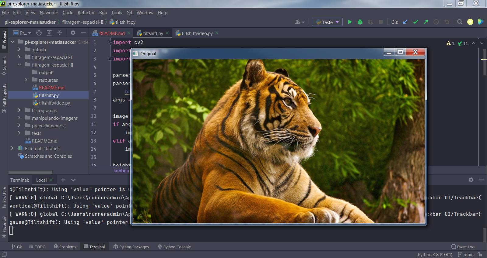

# Filtragem Espacial II

## Requisitos
- Python 3.8
- OpenCV 4.5.3
- Numpy

## 6.1 Exercícios
- Utilizando o programa exemplos/addweighted.cpp como referência, implemente um programa tiltshift.cpp. Três ajustes deverão ser providos na tela da interface:

  - um ajuste para regular a altura da região central que entrará em foco;

  - um ajuste para regular a força de decaimento da região borrada;

  - um ajuste para regular a posição vertical do centro da região que entrará em foco. Finalizado o programa, a imagem produzida deverá ser salva em arquivo.

- Utilizando o programa exemplos/addweighted.cpp como referência, implemente um programa tiltshiftvideo.cpp. Tal programa deverá ser capaz de processar um arquivo de vídeo, produzir o efeito de tilt-shift nos quadros presentes e escrever o resultado em outro arquivo de vídeo. A ideia é criar um efeito de miniaturização de cenas. Descarte quadros em uma taxa que julgar conveniente para evidenciar o efeito de stop motion, comum em vídeos desse tipo.

# Programa tiltshift.py
Desenvolvido em Python

## Exemplos de entrada e saída

<table>
    <tr>
        <th align="Center">Imagem como exemplo de entrada</th>
    </tr> 
    <tr>
        <td>
            
        </td>
    </tr>
    <tr>
        <td>Imagem de entrada para o programa, sem edições.</td>
    </tr>
</table>
<br>
<table>
    <tr>
        <th align="Center">Iniciando o programa</th>
    </tr> 
    <tr>
        <td>
            
        </td>
    </tr>
    <tr>
        <td>Início da execução do programa, imagem carregada colorida</td>
    </tr>
</table>
<br>
<table>
    <tr>
        <th align="Center">Programa carregado</th>
    </tr> 
    <tr>
        <td>
            
        </td>
    </tr>
    <tr>
        <td>Início do tratamento da imagem, todas as opções de configuração estão exatamente na metade, já é possível notar os efeitos produzidos.</td>
    </tr>
</table>
<br>
<table>
    <tr>
        <th align="Center">Execução: Iniciando o programa</th>
    </tr> 
    <tr>
        <td>
            
        </td>
    </tr>
    <tr>
        <td>Início da execução do programa, imagem carregada colorida</td>
    </tr>
</table>
<br>

## Funcionamento do código

Importação das bibliotecas
```
import cv2
import numpy as np
```
\
Criação do kernel para o filtro de média, um filtro de média pega uma área de pixels ao redor de um pixel central, faz a média de todos esses pixels juntos e substitui o pixel central pela média.
Pegando a média da região ao redor de um pixel, estamos suavizando-o e substituindo-o pelo valor de sua vizinhança local. Isso nos permite reduzir o ruído e o nível de detalhe, simplesmente contando com a média.
```
media = np.array([[0.1111, 0.1111, 0.1111],
                  [0.1111, 0.1111, 0.1111],
                  [0.1111, 0.1111, 0.1111]])
```
\
Criação do kernel para o filtro de gauss, o filtro gaussiano é semelhante ao filtro de média, mas em vez de usar uma média simples, estamos agora usando uma média ponderada, onde os pixels da vizinhança que estão mais próximos do pixel central contribuem com mais “peso” para a média.
```
gauss = np.array([[0.0625, 0.125, 0.0625],
                  [0.125, 0.25, 0.125],
                  [0.0625, 0.125, 0.0625]])
```
\
Criação do kernel para o filtro horizontal, é usado para detectar mudanças horizontais no gradiente de imagem.
```
horizontal = np.array([[-1, 0, 1],
                       [-2, 0, 2],
                       [-1, 0, 1]])
```
\
Criação do kernel para o filtro vertical, é usado para detectar mudanças verticais no gradiente de imagem.
```
vertical = np.array([[-1, -2, -1],
                     [0, 0, 0],
                     [1, 2, 1]])
```
\
Criação do kernel para o filtro laplacian, que pode ser usado como uma forma de detecção de borda nas imagens.
```
laplacian = np.array([[0, 1, 0],
                      [1, -4, 1],
                      [0, 1, 0]])
```
\
Criação do kernel para o filtro boost.
```
boost = np.array([[0, -1, 0],
                  [-1, 5.2, -1],
                  [0, -1, 0]])
```
\
Menu onde o usuário escolhe o tipo de filtro que deseja aplicar nas imagens capturadas pela câmera. O filtro de média já é por padrão aplicado no programa.
```
def menu():
    print("Select Filter Function:")
    print("m - media")
    print("g - gauss")
    print("h - horizontal")
    print("v - vertical")
    print("l - laplacian")
    print("b - boost")
    print("x - laplaciano do gaussiano")
```
\
Chamada à função menu() para mostrar ao usuário as opções de filtros disponíveis.\
Variável key=0, será usada para capturar a escolha de filtro pelo usuário.\
Variável kernel_reference recebe o kernel do filtro de média, para ser aplicado por padrão no programa.\
Captura o vídeo da webcam.
```
menu()
key = 0
kernel_reference = media
capture = cv2.VideoCapture(0)
```
\
Início do loop infinito, até que a tecla 'q' seja pressionada.\
A cada iteração do while, captura cada frame e armazena em 'frame', e também uma condição booleana True ou False se existe frame em 'exist_frame'.\
Faz o flip do frame para inverter corrigindo a amostragem.\
Converte o frame para tons de cinza.\
Testa se não existir frame, sai do loop infinito e encerra a execução do programa.
```
while True:
    exist_frame, frame = capture.read()
    frame = cv2.flip(frame, 0)
    frame_gray = cv2.cvtColor(frame, cv2.COLOR_BGR2GRAY)
    if not exist_frame:
        break
```
\
Mostra a sequência de frames originais em tons de cinza.
```
    cv2.imshow("Original", frame_gray)
```
\
Se a tecla pressionada for 103 ou 120 (teclas 'g' e 'x' respectivamente da tabela ASCII), o programa entra nesta condição e executa a função aplicando o filtro de Gaussiano para cada frame.\
A tecla 103 'g' equivale ao usuário selecionar o filtro Gauss.\
A tecla 120 'x' equivale ao usuário selecionar o filtro laplaciano do gaussiano, primeiramente nesta chamada o programa fará a aplicação do filtro gaussiano, para depois aplicar o filtro laplaciano em outra chamada de função.
```
    if key == 103 or key == 120:
        image_filtered = cv2.GaussianBlur(frame_gray, (3, 3), 0)
```
\
Se não for as teclas 'g' ou 'x', o programa entra nesta condição e executa a função de convolução filter2d, onde basicamente é passado como argumento da função o frame em tons de cinza e o kernel de referência escolhido pelo usuário.
```
    else:
        image_filtered = cv2.filter2D(src=frame_gray, ddepth=-1, kernel=kernel_reference)
```
\
Se a tecla pressionada for 108 ou 120 (teclas 'l' e 'x' respectivamente da tabela ASCII), o programa entra nesta condição e executa a função aplicando o filtro Laplaciano para cada frame.\
A tecla 108 'l' equivale ao usuário selecionar o filtro Laplacian.\
A tecla 120 'x' equivale ao usuário selecionar o filtro laplaciano do gaussiano, o filtro gaussiano já foi aplicado em uma chamada de função anterior, agora irá aplicar a função Laplacian para detecção de bordas.
```
    if key == 108 or key == 120:
        # image_filtered = cv2.filter2D(src=image_filtered, ddepth=-1, kernel=laplacian, borderType=cv2.BORDER_DEFAULT)
        image_filtered = cv2.Laplacian(src=image_filtered, ddepth=-1, ksize=3)
```
\
A função convertScaleAbs pega o valor absoluto das imagens de gradiente e , emseguida, comprime os valores de volta para o intervalo [0, 255], inteiros, sem sinal de 8 bits.
```
    image_filtered = cv2.convertScaleAbs(image_filtered)
```
\
Mostra a sequência de frames com o filtro aplicado conforme o usuários selecionou.
```
    cv2.imshow("Filter", image_filtered)
```
\
Testa se a tecla pressionada for 'm', carregando o kernel escolhido para a variável kernel_reference, que será usado como argumento da função filter2d, e imprime o kernel no terminal.\
Filtro de Média.
```
    if cv2.waitKey(1) & 0xFF == ord('m'):
        key = ord('m')
        kernel_reference = media
        print("\nMask Media\n" + str(media))
```
\
Testa se a tecla pressionada for 'g', carregando o kernel escolhido para a variável kernel_reference, que será usado como argumento da função filter2d, e imprime o kernel no terminal.\
Filtro de Gauss.
```
    if cv2.waitKey(1) & 0xFF == ord('g'):
        key = ord('g')
        kernel_reference = gauss
        print("\nMask Gauss\n" + str(gauss))
```
\
Testa se a tecla pressionada for 'h', carregando o kernel escolhido para a variável kernel_reference, que será usado como argumento da função filter2d, e imprime o kernel no terminal.\
Filtro Horizontal.
```
    if cv2.waitKey(1) & 0xFF == ord('h'):
        key = ord('h')
        kernel_reference = horizontal
        print("\nMask Horizontal\n" + str(horizontal))
```
\
Testa se a tecla pressionada for 'v', carregando o kernel escolhido para a variável kernel_reference, que será usado como argumento da função filter2d, e imprime o kernel no terminal.\
Filtro Vertical.
```
    if cv2.waitKey(1) & 0xFF == ord('v'):
        key = ord('v')
        kernel_reference = vertical
        print("\nMask Vertical\n" + str(vertical))
```
\
Testa se a tecla pressionada for 'l', carregando o kernel escolhido para a variável kernel_reference, que será usado como argumento da função filter2d, e imprime o kernel no terminal.\
Filtro Laplacian.
```
    if cv2.waitKey(1) & 0xFF == ord('l'):
        key = ord('l')
        kernel_reference = laplacian
        print("\nMask Laplacian\n" + str(laplacian))
```
\
Testa se a tecla pressionada for 'b', carregando o kernel escolhido para a variável kernel_reference, que será usado como argumento da função filter2d, e imprime o kernel no terminal.\
Filtro Boost.
```
    if cv2.waitKey(1) & 0xFF == ord('b'):
        key = ord('b')
        kernel_reference = boost
        print("\nMask Boost\n" + str(boost))
```
\
Testa se a tecla pressionada for 'x', carregando o kernel escolhido para a variável kernel_reference, que será usado como argumento da função filter2d, e imprime o kernel no terminal.\
Filtro Laplaciano do Gaussiano.
```
    if cv2.waitKey(1) & 0xFF == ord('x'):
        key = ord('x')
        kernel_reference = gauss
        print("\nMask Laplaciano do Gaussiano\nMask Gauss\n" + str(gauss) + "\nMask Laplacian\n" + str(laplacian))
```
\
Testa se a tecla pressionada for 'q', se for encerra o loop infinito e o programa encerra sua execução.
```
    if cv2.waitKey(1) & 0xFF == ord('q'):
        print("Exit")
        break
```
\
Libera todos os recursos utilizados, fecha as janelas abertas e encerra o programa.
```
capture.release()
cv2.destroyAllWindows()
```

## Código final completo em Python
```
import cv2
import numpy as np

media = np.array([[0.1111, 0.1111, 0.1111],
                  [0.1111, 0.1111, 0.1111],
                  [0.1111, 0.1111, 0.1111]])

gauss = np.array([[0.0625, 0.125, 0.0625],
                  [0.125, 0.25, 0.125],
                  [0.0625, 0.125, 0.0625]])

horizontal = np.array([[-1, 0, 1],
                       [-2, 0, 2],
                       [-1, 0, 1]])

vertical = np.array([[-1, -2, -1],
                     [0, 0, 0],
                     [1, 2, 1]])

laplacian = np.array([[0, 1, 0],
                      [1, -4, 1],
                      [0, 1, 0]])

boost = np.array([[0, -1, 0],
                  [-1, 5.2, -1],
                  [0, -1, 0]])


def menu():
    print("Select Filter Function:")
    print("m - media")
    print("g - gauss")
    print("h - horizontal")
    print("v - vertical")
    print("l - laplacian")
    print("b - boost")
    print("x - laplaciano do gaussiano")


menu()
key = 0
kernel_reference = media
capture = cv2.VideoCapture(0)
while True:
    exist_frame, frame = capture.read()
    frame = cv2.flip(frame, 0)
    frame_gray = cv2.cvtColor(frame, cv2.COLOR_BGR2GRAY)
    if not exist_frame:
        break

    cv2.imshow("Original", frame_gray)

    if key == 103 or key == 120:
        image_filtered = cv2.GaussianBlur(frame_gray, (3, 3), 0)
    else:
        image_filtered = cv2.filter2D(src=frame_gray, ddepth=-1, kernel=kernel_reference)

    if key == 108 or key == 120:
        # image_filtered = cv2.filter2D(src=image_filtered, ddepth=-1, kernel=laplacian, borderType=cv2.BORDER_DEFAULT)
        image_filtered = cv2.Laplacian(src=image_filtered, ddepth=-1, ksize=3)

    image_filtered = cv2.convertScaleAbs(image_filtered)

    cv2.imshow("Filter", image_filtered)

    if cv2.waitKey(1) & 0xFF == ord('m'):
        key = ord('m')
        kernel_reference = media
        print("\nMask Media\n" + str(media))
    if cv2.waitKey(1) & 0xFF == ord('g'):
        key = ord('g')
        kernel_reference = gauss
        print("\nMask Gauss\n" + str(gauss))
    if cv2.waitKey(1) & 0xFF == ord('h'):
        key = ord('h')
        kernel_reference = horizontal
        print("\nMask Horizontal\n" + str(horizontal))
    if cv2.waitKey(1) & 0xFF == ord('v'):
        key = ord('v')
        kernel_reference = vertical
        print("\nMask Vertical\n" + str(vertical))
    if cv2.waitKey(1) & 0xFF == ord('l'):
        key = ord('l')
        kernel_reference = laplacian
        print("\nMask Laplacian\n" + str(laplacian))
    if cv2.waitKey(1) & 0xFF == ord('b'):
        key = ord('b')
        kernel_reference = boost
        print("\nMask Boost\n" + str(boost))
    if cv2.waitKey(1) & 0xFF == ord('x'):
        key = ord('x')
        kernel_reference = gauss
        print("\nMask Laplaciano do Gaussiano\nMask Gauss\n" + str(gauss) + "\nMask Laplacian\n" + str(laplacian))
    if cv2.waitKey(1) & 0xFF == ord('q'):
        print("Exit")
        break

capture.release()
cv2.destroyAllWindows()
```
-------------------------------------------------------
## Código do exemplo em C++
```
#include <iostream>
#include <opencv2/opencv.hpp>

void printmask(cv::Mat &m) {
  for (int i = 0; i < m.size().height; i++) {
    for (int j = 0; j < m.size().width; j++) {
      std::cout << m.at<float>(i, j) << ",";
    }
    std::cout << "\n";
  }
}

int main(int, char **) {
  cv::VideoCapture cap;  // open the default camera
  float media[] = {0.1111, 0.1111, 0.1111, 0.1111, 0.1111,
                   0.1111, 0.1111, 0.1111, 0.1111};
  float gauss[] = {0.0625, 0.125,  0.0625, 0.125, 0.25,
                   0.125,  0.0625, 0.125,  0.0625};
  float horizontal[] = {-1, 0, 1, -2, 0, 2, -1, 0, 1};
  float vertical[] = {-1, -2, -1, 0, 0, 0, 1, 2, 1};
  float laplacian[] = {0, -1, 0, -1, 4, -1, 0, -1, 0};
  float boost[] = {0, -1, 0, -1, 5.2, -1, 0, -1, 0};

  cv::Mat frame, framegray, frame32f, frameFiltered;
  cv::Mat mask(3, 3, CV_32F);
  cv::Mat result;
  double width, height;
  int absolut;
  char key;

  cap.open(0);

  if (!cap.isOpened())  // check if we succeeded
    return -1;

  cap.set(cv::CAP_PROP_FRAME_WIDTH, 640);
  cap.set(cv::CAP_PROP_FRAME_HEIGHT, 480);
  width = cap.get(cv::CAP_PROP_FRAME_WIDTH);
  height = cap.get(cv::CAP_PROP_FRAME_HEIGHT);
  std::cout << "largura=" << width << "\n";
  ;
  std::cout << "altura =" << height << "\n";
  ;
  std::cout << "fps    =" << cap.get(cv::CAP_PROP_FPS) << "\n";
  std::cout << "format =" << cap.get(cv::CAP_PROP_FORMAT) << "\n";

  cv::namedWindow("filtroespacial", cv::WINDOW_NORMAL);
  cv::namedWindow("original", cv::WINDOW_NORMAL);

  mask = cv::Mat(3, 3, CV_32F, media);

  absolut = 1;  // calcs abs of the image

  for (;;) {
    cap >> frame;  // get a new frame from camera
    cv::cvtColor(frame, framegray, cv::COLOR_BGR2GRAY);
    cv::flip(framegray, framegray, 1);
    cv::imshow("original", framegray);
    framegray.convertTo(frame32f, CV_32F);
    cv::filter2D(frame32f, frameFiltered, frame32f.depth(), mask,
                 cv::Point(1, 1), 0);
    if (absolut) {
      frameFiltered = cv::abs(frameFiltered);
    }

    frameFiltered.convertTo(result, CV_8U);

    cv::imshow("filtroespacial", result);

    key = (char)cv::waitKey(10);
    if (key == 27) break;  // esc pressed!
    switch (key) {
      case 'a':
        absolut = !absolut;
        break;
      case 'm':
        mask = cv::Mat(3, 3, CV_32F, media);
        printmask(mask);
        break;
      case 'g':
        mask = cv::Mat(3, 3, CV_32F, gauss);
        printmask(mask);
        break;
      case 'h':
        mask = cv::Mat(3, 3, CV_32F, horizontal);
        printmask(mask);
        break;
      case 'v':
        mask = cv::Mat(3, 3, CV_32F, vertical);
        printmask(mask);
        break;
      case 'l':
        mask = cv::Mat(3, 3, CV_32F, laplacian);
        printmask(mask);
        break;
      case 'b':
        mask = cv::Mat(3, 3, CV_32F, boost);
        break;
      default:
        break;
    }
  }
  return 0;
}
```
