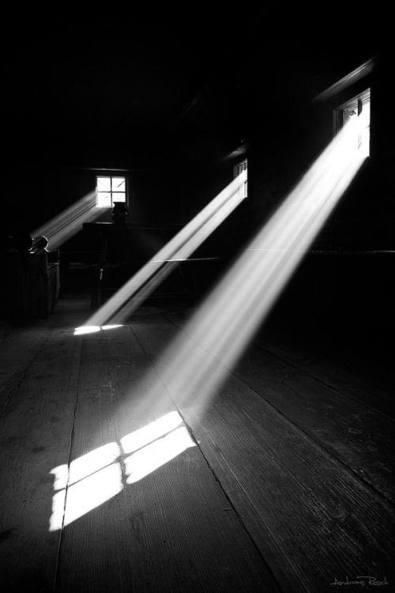
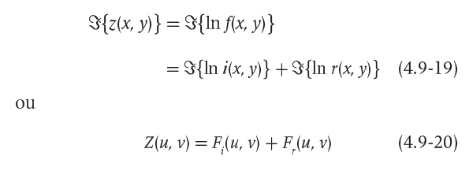
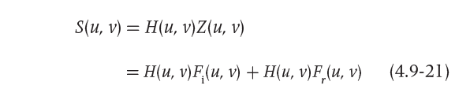

# Filtragem Frequência

## Requisitos
- Python 3.8
- OpenCV 4.5.3
- Numpy

## 7.2 Exercícios
- Utilizando o programa exemplos/dft.cpp como referência, implemente o filtro homomórfico para melhorar imagens com iluminação irregular. 
Crie uma cena mal iluminada e ajuste os parâmetros do filtro homomórfico para corrigir a iluminação da melhor forma possível. 
Assuma que a imagem fornecida é em tons de cinza.

## Programa homomorphic-filter.py
Desenvolvido em Python


## Exemplos de entrada e saída

Imagem original      |     DFT      |    Filtro homomórfico
:-------------------:|:------------:|:-----------------------:
| | 

Imagem original      |     DFT      |    Filtro homomórfico
:-------------------:|:------------:|:-----------------------:
| | 

Imagem original      |     DFT      |    Filtro homomórfico
:-------------------:|:------------:|:-----------------------:
| | 

Imagem original      |     DFT      |    Filtro homomórfico
:-------------------:|:------------:|:-----------------------:
| | 

Imagem original      |     DFT      |    Filtro homomórfico
:-------------------:|:------------:|:-----------------------:
| | 

Imagem original      |     DFT      |    Filtro homomórfico
:-------------------:|:------------:|:-----------------------:
| | 

Imagem original      |     DFT      |    Filtro homomórfico
:-------------------:|:------------:|:-----------------------:
| | 


# Diagrama do filtro homomórfico


## LOG
\
Código equivalente:
```
    padded = np.log(padded + 1.0)
```

## DFT
\
Código equivalente:
```
    complex_image = cv2.dft(np.float32(padded), flags=cv2.DFT_COMPLEX_OUTPUT)
```

## H(u,v)
\
Código equivalente:
```
    for u in range(dft_M):
        for v in range(dft_N):
            d[u, v] = sqrt((u - dft_M / 2.0) * (u - dft_M / 2.0) + (v - dft_N / 2.0) * (v - dft_N / 2.0))

    d2 = cv2.multiply(d, d) / (d0 * d0)
    re = np.exp(- c * d2)
    h = (yh - yl) * (1 - re) + yl
```

## D(u,v)
\
D(u, v) é a distância entre um ponto (u, v) no domínio da frequência e o centro do retângulo de frequência
Código equivalente:
```
    for u in range(dft_M):
        for v in range(dft_N):
            d[u, v] = sqrt((u - dft_M / 2.0) * (u - dft_M / 2.0) + (v - dft_N / 2.0) * (v - dft_N / 2.0))
```
## S(u,v)
\
Código equivalente:
```
    filtered = cv2.mulSpectrums(complex_image, h, 0)
```


## DFT inversa
\
Código equivalente:
```
    filtered = cv2.idft(filtered)
```

## EXP
\
Código equivalente:
```
    filtered = np.exp(filtered - 1.0)
```


## Funcionamento do código

Importação das bibliotecas.
```
import cv2
import numpy as np
from math import exp, sqrt
```
\
Leitura da imagem e das suas propriedades altura e largura.
```
image = cv2.imread("resources/image1.png", 0)
height, width = image.shape[:2]
```
\
A função ```getOptimalDFTSize()``` identifica os melhores valores com base no tamanho fornecido para acelerar o processo de cálculo da DFT 
com base em algum algoritmo otimizado. Segundo a documentação do OpenCV, valores múltiplos de dois, três e cinco produzem resultados melhores. 
Os valores de tamanho ideal para a quantidade de linhas e colunas da imagem são armazenados nas variáveis ```dft_M``` e ```dft_N```, respectivamente.
```
dft_M = cv2.getOptimalDFTSize(height)
dft_N = cv2.getOptimalDFTSize(width)
```
\
Declaração e inicialização das variáveis globais, parâmetros do filtro que serão aplicados à fórmula.
```
yh, yl, c, d0 = 0, 0, 0, 0
```
\
Declaração e inicialização das variáveis globais, parâmetros que serão setados pelo usuário através das Trackbar.
```
y_track, d0_track, c_track = 0, 0, 0
```
\
Declaração e inicialização da variável global, usada para criar a matriz complexa.
```
complex_image = 0
```
\
Declaração da função que representa o filtro homomórfico.
```
def homomorphic():
```
\
Configuração para usar as variáveis globais dentro do escopo desta função.
```
    global yh, yl, c, d0, complex_image
```
\
Cria um array conforme o shape e o tipo passado como argumento.
```
    d = np.zeros(complex_image.shape, dtype=np.float32)
```
\
xxxxxxxxxxxxxxxxxxxxxxxxxxxxxxxxxxxxxxxxx

```
    for u in range(dft_M):
        for v in range(dft_N):
            d[u, v] = sqrt((u - dft_M / 2.0) * (u - dft_M / 2.0) + (v - dft_N / 2.0) * (v - dft_N / 2.0))

    d2 = cv2.multiply(d, d) / (d0 * d0)
    re = np.exp(- c * d2)
    h = (yh - yl) * (1 - re) + yl
```
\
Multiplicação por elemento das duas matrizes complexas.
```
    filtered = cv2.mulSpectrums(complex, h, 0)
```
\
Função do Numpy que posiciona os quadrantes das imagens nas suas posições originais.
```
    filtered = np.fft.ifftshift(filtered)
```
\
Realiza a Transformada Discreta de Fourier Inversa
```
    filtered = cv2.idft(filtered)
```
\
Calcula a magnitude do vetor 2D (filtered) formado pelos elementos correspondetes x e y do array. Após realiza a normalização.
```
    filtered = cv2.magnitude(filtered[:, :, 0], filtered[:, :, 1])
    cv2.normalize(filtered, filtered, 0, 1, cv2.NORM_MINMAX)
```
\
Como o resultado filtrado foi formado pelo cálculo do logaritmo natural da imagem de entrada, revertemos o processo calculando o exponencial do resultado filtrado para formar a imagem de saída, subtraindo o valor '1.0' adicionado anteriormente para evitar log(0). Após realiza a normalização.
```
    filtered = np.exp(filtered - 1.0)
    cv2.normalize(filtered, filtered, 0, 1, cv2.NORM_MINMAX)
```
\
Cria uma janela com o nome 'homomorphic', mostra o resultado filtrado nesta janela, e salva o resultado filtrado em arquivo.
```
    cv2.namedWindow('homomorphic', cv2.WINDOW_NORMAL)
    cv2.imshow("homomorphic", filtered)
    cv2.imwrite("output/output.png", filtered * 255)
```
\
Função para atribuir valores ao 'yl', de origem da Trackbar, configurados pelo usuário durante a execução do programa. Há verificação para evitar que 'yl' tenha valor igual a zero ou que 'yl' seja maior que 'yh'. Após realiza a chamada para a função homomorphic().
```
def setyl(y_track):
    global yl
    yl = y_track / 100.0
    if yl == 0:
        yl = 0.1
    if yl > yh:
        yl = yh - 1
    homomorphic()
```
\
Função para atribuir valores ao 'yh', de origem da Trackbar, configurados pelo usuário durante a execução do programa. Há verificação para evitar que 'yh' tenha valor igual a zero ou que 'yl' seja maior que 'yh'. Após realiza a chamada para a função homomorphic().
```
def setyh(y_track):
    global yh
    yh = y_track / 100.0
    if yh == 0:
        yh = 0.1
    if yl > yh:
        yh = yl + 1
    homomorphic()
```
\
Função para atribuir valores ao 'c', de origem da Trackbar, configurados pelo usuário durante a execução do programa. Há verificação para evitar que 'c' tenha valor igual a zero. Após realiza a chamada para a função homomorphic().
```
def setc(c_track):
    global c
    c = c_track / 1000.0
    if c == 0:
        c = 1
    homomorphic()
```
\
Função para atribuir valores ao 'd0', de origem da Trackbar, configurados pelo usuário durante a execução do programa. Há verificação para evitar que 'd0' tenha valor igual a zero. Após realiza a chamada para a função homomorphic().
```
def setd0(d0_track):
    global d0
    d0 = d0_track
    if d0 == 0:
        d0 = 1
    homomorphic()
```
\
Função principal do programa.
```
def main():
```
\
A função ```copyMakeBorder()``` cria uma versão da imagem fornecida com uma borda preenchida com zeros e ajustada ao tamanho ótimo para cálculo da DFT, conforme indicado pelo uso da função ```getOptimalDFTSize()```. Para uma imagem ```image``` fornecida, a saída é produzida na imagem ```padded```. Caso a imagem fornecida já possua dimensões apropriadas, a imagem de saída será igual à de entrada.
```
    padded = cv2.copyMakeBorder(image, 0, dft_M - height, 0, dft_N - width, cv2.BORDER_CONSTANT, 0)
```
\
Realiza o logaritmo natural da imagem.
```
    padded = np.log(padded + 1.0)
```
\
Tornando a variável 'complex_image' em escopo global. Realiza a Transformada Discreta de Fourier através da função do OpenCV ```cv2.dft()```. Como alternativa, também é possível utilizar a função do Numpy ```np.fft.fft2()```, está em comentário no código. O resultado da Transformada Discreta de Fourier é uma imagem complexa.
```
    global complex_image
    complex_image = cv2.dft(np.float32(padded), flags=cv2.DFT_COMPLEX_OUTPUT)
    # complex_image = np.fft.fft2(padded)
```
\
Função do Numpy que realiza a troca dos quadrantes da imagem complexa.
```
    complexImage = np.fft.fftshift(complex_image)
```
\
Calcula a magnitude do espectro para ser mostrado na tela, utilizando a função do OpenCV ```cv2.magnitude()```. Como alternativa, também é possível utilizar a função do Numpy ```np.abs()```, está em comentário no código.
```
    magnitude_spectrum = 15 * np.log(cv2.magnitude(complex_image[:, :, 0], complex_image[:, :, 1]))
    # magnitude_spectrum = 15 * np.log(np.abs(complex_image))
```
\
Cria uma janela com o nome 'Image', mostra a imagem original em tons de cinza nesta janela, salva em arquivo esta imagem. Para mostrar a imagem na janela, é realizado o ajuste de tamanho para 600 x 600.
```
    cv2.namedWindow('Image', cv2.WINDOW_NORMAL)
    cv2.imshow("Image", image)
    cv2.imwrite("output/original-gray.png", image)
    cv2.resizeWindow("Image", 600, 600)
```
\
Cria uma janela com o nome 'DFT', mostra a Transformada Discreta de Fourier da imagem, salva em arquivo esta imagem. Para mostrar a imagem na janela, é realizado o ajuste de tamanho para 600 x 600.
```
    cv2.namedWindow('DFT', cv2.WINDOW_NORMAL)
    cv2.imshow("DFT", np.uint8(magnitude_spectrum))
    cv2.imwrite("output/dft.png", np.uint8(magnitude_spectrum))
    cv2.resizeWindow("DFT", 600, 600)
```
\
Cria uma Trackbar na janela 'Image', com os parâmetros 'yl', 'yh', 'c' e 'd0', com seus respectivos valores de inicialização, limites máximos e chamadas as respectivas funções que validam e configuram os parâmetros.
```
    cv2.createTrackbar("YL", "Image", y_track, 100, setyl)
    cv2.createTrackbar("YH", "Image", y_track, 100, setyh)
    cv2.createTrackbar("C", "Image", c_track, 100, setc)
    cv2.createTrackbar("D0", "Image", d0_track, 100, setd0)
```
\
Aguarda pressionar alguma tecla para encerrar o programa, fechando todas as janelas abertas e liberando os recursos utilizados.
```
    cv2.waitKey(0)
    cv2.destroyAllWindows()
```
\
Entrypoint do programa.
```
if __name__ == '__main__':
    main()
```


## Código final completo em Python
```


```
-------------------------------------------------------

## Código do exemplo em C++
```


```
