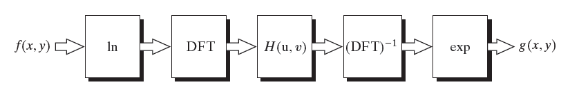
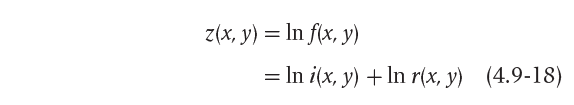
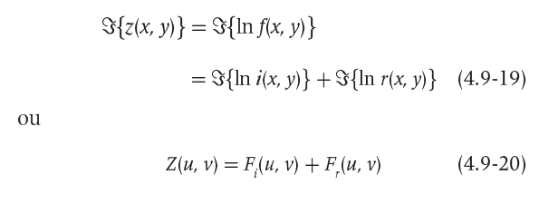
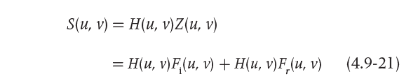
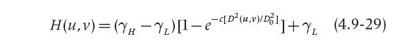
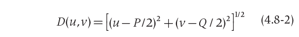
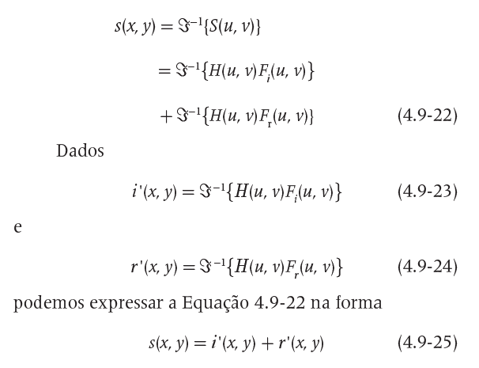
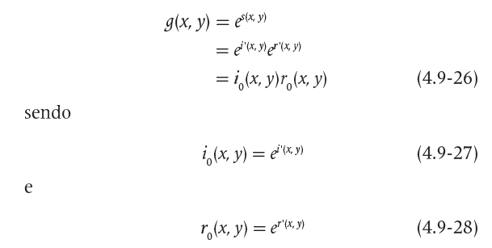
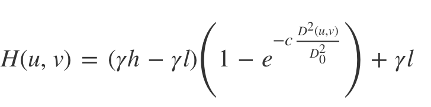

# Filtragem Frequência

## Requisitos
- Python 3.8
- OpenCV 4.5.3
- Numpy

## 7.2 Exercícios
- Utilizando o programa exemplos/dft.cpp como referência, implemente o filtro homomórfico para melhorar imagens com iluminação irregular. 
Crie uma cena mal iluminada e ajuste os parâmetros do filtro homomórfico para corrigir a iluminação da melhor forma possível. 
Assuma que a imagem fornecida é em tons de cinza.

## Programa homomorphic-filter.py
Desenvolvido em Python


# Diagrama do filtro homomórfico


## LOG
\
Código:
```
    padded = np.log(padded + 1.0)
```

## DFT
\
Código:
```
    complex_image = cv2.dft(np.float32(padded), flags=cv2.DFT_COMPLEX_OUTPUT)
```


## H(u,v)


## H(u,v) fórmula
\
Código:
```
    for u in range(dft_M):
        for v in range(dft_N):
            d[u, v] = sqrt((u - dft_M / 2.0) * (u - dft_M / 2.0) + (v - dft_N / 2.0) * (v - dft_N / 2.0))

    d2 = cv2.multiply(d, d) / (d0 * d0)
    re = np.exp(- c * d2)
    h = (yh - yl) * (1 - re) + yl
```

## D(u,v) fórmula
\
Código:
```
    for u in range(dft_M):
        for v in range(dft_N):
            d[u, v] = sqrt((u - dft_M / 2.0) * (u - dft_M / 2.0) + (v - dft_N / 2.0) * (v - dft_N / 2.0))
```

## DFT inversa


## EXP


## Exemplos de entrada e saída

<table>
    <tr>
        <th align="Center">Imagem como exemplo de entrada</th>
    </tr> 
    <tr>
        <td>
            
        </td>
    </tr>
    <tr>
        <td>Imagem de entrada para o programa, sem edições.</td>
    </tr>
</table>
<br>


## Funcionamento do código

Importação das bibliotecas.
```
import cv2
import numpy as np
from math import exp, sqrt
```
\
Leitura da imagem e das suas propriedades altura e largura.
```
image = cv2.imread("resources/image1.png", 0)
height, width = image.shape[:2]
```
\
A função ```getOptimalDFTSize()``` identifica os melhores valores com base no tamanho fornecido para acelerar o processo de cálculo da DFT 
com base em algum algoritmo otimizado. Segundo a documentação do OpenCV, valores múltiplos de dois, três e cinco produzem resultados melhores. 
Os valores de tamanho ideal para a quantidade de linhas e colunas da imagem são armazenados nas variáveis ```dft_M``` e ```dft_N```, respectivamente.
```
dft_M = cv2.getOptimalDFTSize(height)
dft_N = cv2.getOptimalDFTSize(width)
```
\
Declaração e inicialização das variáveis globais, parâmetros do filtro que serão aplicados à fórmula.
```
yh, yl, c, d0 = 0, 0, 0, 0
```
\
Declaração e inicialização das variáveis globais, parâmetros que serão setados pelo usuário através das Trackbar.
```
y_track, d0_track, c_track = 0, 0, 0
```
\
Declaração e inicialização da variável global, usada para criar a matriz complexa.
```
complexImage = 0
```
\
Declaração da função que representa o filtro homomórfico.
```
def homomorphic():
```
\
Configuração para usar as variáveis globais dentro do escopo desta função.
```
    global yh, yl, c, d0, complexImage
```
\
Cria um array conforme o shape e o tipo passado como argumento.
```
    du = np.zeros(complexImage.shape, dtype=np.float32)
```
\
xxxxxxxxxxxxxxxxxxxxxxxxxxxxxxxxxxxxxxxxx
\


```
    # H(u, v)
    for u in range(dft_M):
        for v in range(dft_N):
            du[u, v] = sqrt((u - dft_M / 2.0) * (u - dft_M / 2.0) + (v - dft_N / 2.0) * (v - dft_N / 2.0))

    du2 = cv2.multiply(du, du) / (d0 * d0)
    re = np.exp(- c * du2)
    H = (yh - yl) * (1 - re) + yl
```
\
Multiplicação por elemento das duas matrizes complexas.
```
    # S(u, v)
    filtered = cv2.mulSpectrums(complex, H, 0)
```
\
Transformada discreta de Fourier através da biblioteca Numpy, utilizando a função ```np.fft```. Primeiramente é realizado o deslocamento da componente de frequência zero para o centro do espectro usando a função do Numpy ```np.fft.fftshift()```, porém ainda precisamos fazer a inversão, então finalizamos usando a função do Numpy ```np.fft.ifftshift()```.
```
    filtered = np.fft.ifftshift(filtered)
    filtered = cv2.idft(filtered)
```
\
xxxxxxxxxxxxxxxxxxxxxxxxxxxxxx
```
    # normalization to be representable
    filtered = cv2.magnitude(filtered[:, :, 0], filtered[:, :, 1])
    cv2.normalize(filtered, filtered, 0, 1, cv2.NORM_MINMAX)
```
\
xxxxxxxxxxxxxxxxxxxxxxxxxxxxxx
```
    # g(x, y) = exp(s(x, y))
    filtered = np.exp(filtered)
    cv2.normalize(filtered, filtered, 0, 1, cv2.NORM_MINMAX)
```
\
xxxxxxxxxxxxxxxxxxxxxxxxxxxxxxxxxxxx
```
    cv2.namedWindow('homomorphic', cv2.WINDOW_NORMAL)
    cv2.imshow("homomorphic", filtered)
    cv2.resizeWindow("homomorphic", 600, 550)
```
\
xxxxxxxxxxxxxxxxxxxxxxxx
```
def setyl(y_track):
    global yl
    yl = y_track
    if yl == 0:
        yl = 1
    if yl > yh:
        yl = yh - 1
    homomorphic()
```
\
xxxxxxxxxxxxxxxxxxx
```
def setyh(y_track):
    global yh
    yh = y_track
    if yh == 0:
        yh = 1
    if yl > yh:
        yh = yl + 1
    homomorphic()
```
\
xxxxxxxxxxxxxxxxxxxxx
```
def setc(c_track):
    global c
    c = c_track / 1000.0
    if c == 0:
        c = 1
    homomorphic()
```
\
xxxxxxxxxxxxxxxxxxxxxxxxx
```
def setd0(d0_track):
    global d0
    d0 = d0_track
    if d0 == 0:
        d0 = 1
    homomorphic()
```
\
Função principal do programa.
```
def main():
```
\
A função ```copyMakeBorder()``` cria uma versão da imagem fornecida com uma borda preenchida com zeros e ajustada ao tamanho ótimo para cálculo da DFT, 
conforme indicado pelo uso da função ```getOptimalDFTSize()```. Para uma imagem ```image``` fornecida, a saída é produzida na imagem ```padded```. 
Perceba que, caso a imagem fornecida já possua dimensões apropriadas, a imagem de saída será igual à de entrada.
```
    padded = cv2.copyMakeBorder(image, 0, dft_M - height, 0, dft_N - width, cv2.BORDER_CONSTANT, 0)
```
\
xxxxxxxxxxxxxxxxxxxxxxxxxxxxxxxxxxxxxx
```
    # +1 pra tratar log(0)
    padded = np.log(padded + 1)
```
\
xxxxxxxxxxxxxxx
```
    global complexImage
```
\
xxxxxxxxxxxxxxxxxxxxxxxxxx
```
    complexImage = cv2.dft(np.float32(padded) / 255.0, flags=cv2.DFT_COMPLEX_OUTPUT)
```
\
xxxxxxxxxxxxxxxxxxxxxxxxx
```
    complexImage = np.fft.fftshift(complexImage)
```
\
xxxxxxxxxxxxxxxxxxxxxxxxxxxxx
```
    img = 20 * np.log(cv2.magnitude(complexImage[:, :, 0], complexImage[:, :, 1]))
```
\
xxxxxxxxxxxxxxxxxxxxxxxxxxxxx
```
    cv2.namedWindow('Image', cv2.WINDOW_NORMAL)
    cv2.imshow("Image", image)
    cv2.imwrite("teste2.jpg", image)
    cv2.resizeWindow("Image", 400, 400)
```
\
xxxxxxxxxxxxxxxxxxxxxxxxxxx
```
    cv2.namedWindow('DFT', cv2.WINDOW_NORMAL)
    cv2.imshow("DFT", np.uint8(img))
    cv2.imwrite("dft.jpg", np.uint8(img))
    cv2.resizeWindow("DFT", 250, 250)
```
\
xxxxxxxxxxxxxxxxxxxxxxxxxxx
```
    cv2.createTrackbar("YL", "Image", y_track, 100, setyl)
    cv2.createTrackbar("YH", "Image", y_track, 100, setyh)
    cv2.createTrackbar("C", "Image", c_track, 100, setc)
    cv2.createTrackbar("D0", "Image", d0_track, 100, setd0)
```
\
xxxxxxxxxxxxxxxxxxxxxxx
```
    cv2.waitKey(0)
    cv2.destroyAllWindows()
```
\
xxxxxxxxxxxxxxxxxxxx
```
if __name__ == '__main__':
    main()
```


## Código final completo em Python
```


```
-------------------------------------------------------

## Código do exemplo em C++
```


```
