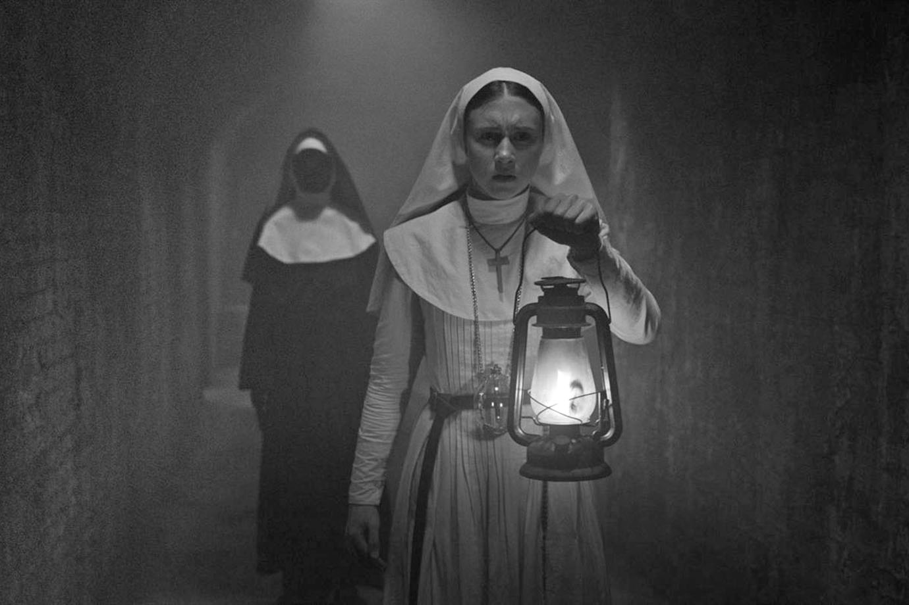
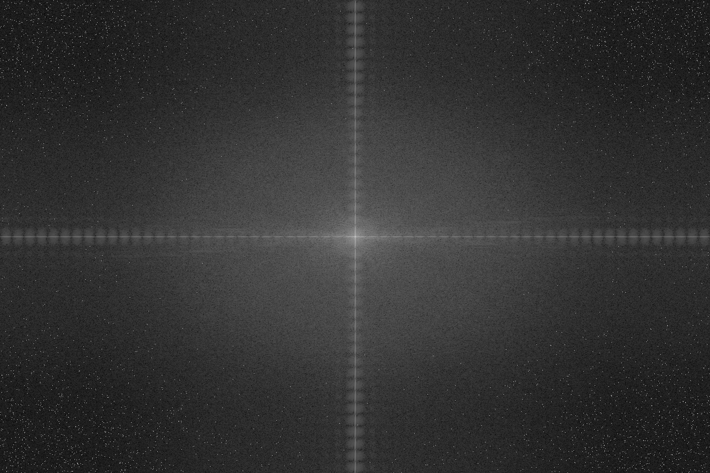

# Filtragem Frequência

## Requisitos
- Python 3.8
- OpenCV 4.5.3
- Numpy

## 7.2 Exercícios
- Utilizando o programa exemplos/dft.cpp como referência, implemente o filtro homomórfico para melhorar imagens com iluminação irregular. 
Crie uma cena mal iluminada e ajuste os parâmetros do filtro homomórfico para corrigir a iluminação da melhor forma possível. 
Assuma que a imagem fornecida é em tons de cinza.

## Programa homomorphic-filter.py
Desenvolvido em Python


## Exemplos de entrada e saída

Imagem original      |     DFT      |    Filtro homomórfico
:-------------------:|:------------:|:-----------------------:
| | 

Imagem original      |     DFT      |    Filtro homomórfico
:-------------------:|:------------:|:-----------------------:
| | 

Imagem original      |     DFT      |    Filtro homomórfico
:-------------------:|:------------:|:-----------------------:
| | 

Imagem original      |     DFT      |    Filtro homomórfico
:-------------------:|:------------:|:-----------------------:
| | 

Imagem original      |     DFT      |    Filtro homomórfico
:-------------------:|:------------:|:-----------------------:
| | 

Imagem original      |     DFT      |    Filtro homomórfico
:-------------------:|:------------:|:-----------------------:
| | 

Imagem original      |     DFT      |    Filtro homomórfico
:-------------------:|:------------:|:-----------------------:
| | 

Imagem original      |     DFT      |    Filtro homomórfico
:-------------------:|:------------:|:-----------------------:
| | 


# Diagrama do filtro homomórfico


## LOG
\
Código equivalente:
```
    padded = np.log(padded + 1.0)
```

## DFT
\
Código equivalente:
```
    complex_image = cv2.dft(np.float32(padded), flags=cv2.DFT_COMPLEX_OUTPUT)
```

## H(u,v)
\
Código equivalente:
```
    for u in range(dft_M):
        for v in range(dft_N):
            d[u, v] = sqrt((u - dft_M / 2.0) * (u - dft_M / 2.0) + (v - dft_N / 2.0) * (v - dft_N / 2.0))

    d2 = cv2.multiply(d, d) / (d0 * d0)
    re = np.exp(- c * d2)
    h = (yh - yl) * (1 - re) + yl
```

## D(u,v)
\
D(u, v) é a distância entre um ponto (u, v) no domínio da frequência e o centro do retângulo de frequência
Código equivalente:
```
    for u in range(dft_M):
        for v in range(dft_N):
            d[u, v] = sqrt((u - dft_M / 2.0) * (u - dft_M / 2.0) + (v - dft_N / 2.0) * (v - dft_N / 2.0))
```
## S(u,v)
\
Código equivalente:
```
    filtered = cv2.mulSpectrums(complex_image, h, 0)
```


## DFT inversa
\
Código equivalente:
```
    filtered = cv2.idft(filtered)
```

## EXP
\
Código equivalente:
```
    filtered = np.exp(filtered - 1.0)
```


## Funcionamento do código

Importação das bibliotecas.
```
import cv2
import numpy as np
from math import exp, sqrt
```
\
Leitura da imagem e das suas propriedades altura e largura.
```
image = cv2.imread("resources/image1.png", 0)
height, width = image.shape[:2]
```
\
A função ```getOptimalDFTSize()``` identifica os melhores valores com base no tamanho fornecido para acelerar o processo de cálculo da DFT 
com base em algum algoritmo otimizado. Segundo a documentação do OpenCV, valores múltiplos de dois, três e cinco produzem resultados melhores. 
Os valores de tamanho ideal para a quantidade de linhas e colunas da imagem são armazenados nas variáveis ```dft_M``` e ```dft_N```, respectivamente.
```
dft_M = cv2.getOptimalDFTSize(height)
dft_N = cv2.getOptimalDFTSize(width)
```
\
Declaração e inicialização das variáveis globais, parâmetros do filtro que serão aplicados à fórmula.
```
yh, yl, c, d0 = 0, 0, 0, 0
```
\
Declaração e inicialização das variáveis globais, parâmetros que serão setados pelo usuário através das Trackbar.
```
y_track, d0_track, c_track = 0, 0, 0
```
\
Declaração e inicialização da variável global, usada para criar a matriz complexa.
```
complex_image = 0
```
\
Declaração da função que representa o filtro homomórfico.
```
def homomorphic():
```
\
Configuração para usar as variáveis globais dentro do escopo desta função.
```
    global yh, yl, c, d0, complex_image
```
\
Cria um array conforme o shape e o tipo passado como argumento.
```
    d = np.zeros(complex_image.shape, dtype=np.float32)
```
\
Filtro passa alto gaussiano.

```
    for u in range(dft_M):
        for v in range(dft_N):
            d[u, v] = sqrt((u - dft_M / 2.0) * (u - dft_M / 2.0) + (v - dft_N / 2.0) * (v - dft_N / 2.0))

    d2 = cv2.multiply(d, d) / (d0 * d0)
    re = np.exp(- c * d2)
    h = (yh - yl) * (1 - re) + yl
```
\
Multiplicação por elemento das duas matrizes complexas.
```
    filtered = cv2.mulSpectrums(complex, h, 0)
```
\
Função do Numpy que posiciona os quadrantes das imagens nas suas posições originais.
```
    filtered = np.fft.ifftshift(filtered)
```
\
Realiza a Transformada Discreta de Fourier Inversa
```
    filtered = cv2.idft(filtered)
```
\
Calcula a magnitude do vetor 2D (filtered) formado pelos elementos correspondetes x e y do array. Após realiza a normalização.
```
    filtered = cv2.magnitude(filtered[:, :, 0], filtered[:, :, 1])
    cv2.normalize(filtered, filtered, 0, 1, cv2.NORM_MINMAX)
```
\
Como o resultado filtrado foi formado pelo cálculo do logaritmo natural da imagem de entrada, revertemos o processo calculando o exponencial do resultado filtrado para formar a imagem de saída, subtraindo o valor '1.0' adicionado anteriormente para evitar log(0). Após realiza a normalização.
```
    filtered = np.exp(filtered - 1.0)
    cv2.normalize(filtered, filtered, 0, 1, cv2.NORM_MINMAX)
```
\
Cria uma janela com o nome 'homomorphic', mostra o resultado filtrado nesta janela, e salva o resultado filtrado em arquivo.
```
    cv2.namedWindow('homomorphic', cv2.WINDOW_NORMAL)
    cv2.imshow("homomorphic", filtered)
    cv2.imwrite("output/output.png", filtered * 255)
```
\
Função para atribuir valores ao 'yl', de origem da Trackbar, configurados pelo usuário durante a execução do programa. Há verificação para evitar que 'yl' tenha valor igual a zero ou que 'yl' seja maior que 'yh'. Após realiza a chamada para a função homomorphic().
```
def setyl(y_track):
    global yl
    yl = y_track / 100.0
    if yl == 0:
        yl = 0.1
    if yl > yh:
        yl = yh - 1
    homomorphic()
```
\
Função para atribuir valores ao 'yh', de origem da Trackbar, configurados pelo usuário durante a execução do programa. Há verificação para evitar que 'yh' tenha valor igual a zero ou que 'yl' seja maior que 'yh'. Após realiza a chamada para a função homomorphic().
```
def setyh(y_track):
    global yh
    yh = y_track / 100.0
    if yh == 0:
        yh = 0.1
    if yl > yh:
        yh = yl + 1
    homomorphic()
```
\
Função para atribuir valores ao 'c', de origem da Trackbar, configurados pelo usuário durante a execução do programa. Há verificação para evitar que 'c' tenha valor igual a zero. Após realiza a chamada para a função homomorphic().
```
def setc(c_track):
    global c
    c = c_track / 1000.0
    if c == 0:
        c = 1
    homomorphic()
```
\
Função para atribuir valores ao 'd0', de origem da Trackbar, configurados pelo usuário durante a execução do programa. Há verificação para evitar que 'd0' tenha valor igual a zero. Após realiza a chamada para a função homomorphic().
```
def setd0(d0_track):
    global d0
    d0 = d0_track
    if d0 == 0:
        d0 = 1
    homomorphic()
```
\
Função principal do programa.
```
def main():
```
\
A função ```copyMakeBorder()``` cria uma versão da imagem fornecida com uma borda preenchida com zeros e ajustada ao tamanho ótimo para cálculo da DFT, conforme indicado pelo uso da função ```getOptimalDFTSize()```. Para uma imagem ```image``` fornecida, a saída é produzida na imagem ```padded```. Caso a imagem fornecida já possua dimensões apropriadas, a imagem de saída será igual à de entrada.
```
    padded = cv2.copyMakeBorder(image, 0, dft_M - height, 0, dft_N - width, cv2.BORDER_CONSTANT, 0)
```
\
Realiza o logaritmo natural da imagem.
```
    padded = np.log(padded + 1.0)
```
\
Tornando a variável 'complex_image' em escopo global. Realiza a Transformada Discreta de Fourier através da função do OpenCV ```cv2.dft()```. Como alternativa, também é possível utilizar a função do Numpy ```np.fft.fft2()```, está em comentário no código. O resultado da Transformada Discreta de Fourier é uma imagem complexa.
```
    global complex_image
    complex_image = cv2.dft(np.float32(padded), flags=cv2.DFT_COMPLEX_OUTPUT)
    # complex_image = np.fft.fft2(padded)
```
\
Função do Numpy que realiza a troca dos quadrantes da imagem complexa.
```
    complexImage = np.fft.fftshift(complex_image)
```
\
Calcula a magnitude do espectro para ser mostrado na tela, utilizando a função do OpenCV ```cv2.magnitude()```. Como alternativa, também é possível utilizar a função do Numpy ```np.abs()```, está em comentário no código.
```
    magnitude_spectrum = 15 * np.log(cv2.magnitude(complex_image[:, :, 0], complex_image[:, :, 1]))
    # magnitude_spectrum = 15 * np.log(np.abs(complex_image))
```
\
Cria uma janela com o nome 'Image', mostra a imagem original em tons de cinza nesta janela, salva em arquivo esta imagem. Para mostrar a imagem na janela, é realizado o ajuste de tamanho para 600 x 600.
```
    cv2.namedWindow('Image', cv2.WINDOW_NORMAL)
    cv2.imshow("Image", image)
    cv2.imwrite("output/original-gray.png", image)
    cv2.resizeWindow("Image", 600, 600)
```
\
Cria uma janela com o nome 'DFT', mostra a Transformada Discreta de Fourier da imagem, salva em arquivo esta imagem. Para mostrar a imagem na janela, é realizado o ajuste de tamanho para 600 x 600.
```
    cv2.namedWindow('DFT', cv2.WINDOW_NORMAL)
    cv2.imshow("DFT", np.uint8(magnitude_spectrum))
    cv2.imwrite("output/dft.png", np.uint8(magnitude_spectrum))
    cv2.resizeWindow("DFT", 600, 600)
```
\
Cria uma Trackbar na janela 'Image', com os parâmetros 'yl', 'yh', 'c' e 'd0', com seus respectivos valores de inicialização, limites máximos e chamadas as respectivas funções que validam e configuram os parâmetros.
```
    cv2.createTrackbar("YL", "Image", y_track, 100, setyl)
    cv2.createTrackbar("YH", "Image", y_track, 100, setyh)
    cv2.createTrackbar("C", "Image", c_track, 100, setc)
    cv2.createTrackbar("D0", "Image", d0_track, 100, setd0)
```
\
Aguarda pressionar alguma tecla para encerrar o programa, fechando todas as janelas abertas e liberando os recursos utilizados.
```
    cv2.waitKey(0)
    cv2.destroyAllWindows()
```
\
Entrypoint do programa.
```
if __name__ == '__main__':
    main()
```


## Código final completo em Python
```
import cv2
import numpy as np
from math import exp, sqrt

image = cv2.imread("resources/image1.png", 0)
height, width = image.shape[:2]

dft_M = cv2.getOptimalDFTSize(height)
dft_N = cv2.getOptimalDFTSize(width)


yh, yl, c, d0 = 0, 0, 0, 0

y_track, d0_track, c_track = 0, 0, 0

complex_image = 0


def homomorphic():
    global yh, yl, c, d0, complex_image
    d = np.zeros(complex_image.shape, dtype=np.float32)

    for u in range(dft_M):
        for v in range(dft_N):
            d[u, v] = sqrt((u - dft_M / 2.0) * (u - dft_M / 2.0) + (v - dft_N / 2.0) * (v - dft_N / 2.0))

    d2 = cv2.multiply(d, d) / (d0 * d0)
    re = np.exp(- c * d2)
    h = (yh - yl) * (1 - re) + yl

    filtered = cv2.mulSpectrums(complex_image, h, 0)

    filtered = np.fft.ifftshift(filtered)
    filtered = cv2.idft(filtered)

    filtered = cv2.magnitude(filtered[:, :, 0], filtered[:, :, 1])
    cv2.normalize(filtered, filtered, 0, 1, cv2.NORM_MINMAX)

    filtered = np.exp(filtered - 1.0)
    cv2.normalize(filtered, filtered, 0, 1, cv2.NORM_MINMAX)

    cv2.namedWindow('homomorphic', cv2.WINDOW_AUTOSIZE)
    cv2.imshow("homomorphic", filtered)
    cv2.imwrite("output/output.png", filtered * 255)


def setyl(y_track):
    global yl
    yl = y_track / 100.0
    if yl == 0:
        yl = 0.1
    if yl > yh:
        yl = yh - 1
    homomorphic()


def setyh(y_track):
    global yh
    yh = y_track / 100.0
    if yh == 0:
        yh = 0.1
    if yl > yh:
        yh = yl + 1
    homomorphic()


def setc(c_track):
    global c
    c = c_track / 1000.0
    if c == 0:
        c = 1
    homomorphic()


def setd0(d0_track):
    global d0
    d0 = d0_track
    if d0 == 0:
        d0 = 1
    homomorphic()


def main():

    padded = cv2.copyMakeBorder(image, 0, dft_M - height, 0, dft_N - width, cv2.BORDER_CONSTANT, 0)

    padded = np.log(padded + 1.0)

    global complex_image
    complex_image = cv2.dft(np.float32(padded), flags=cv2.DFT_COMPLEX_OUTPUT)
    # complex_image = np.fft.fft2(padded)

    complex_image = np.fft.fftshift(complex_image)

    magnitude_spectrum = 15 * np.log(cv2.magnitude(complex_image[:, :, 0], complex_image[:, :, 1]))
    # magnitude_spectrum = 15 * np.log(np.abs(complex_image))

    cv2.namedWindow('Image', cv2.WINDOW_NORMAL)
    cv2.imshow("Image", image)
    cv2.imwrite("output/original-gray.png", image)
    cv2.resizeWindow("Image", 600, 600)

    cv2.namedWindow('DFT', cv2.WINDOW_NORMAL)
    cv2.imshow("DFT", np.uint8(magnitude_spectrum))
    cv2.imwrite("output/dft.png", np.uint8(magnitude_spectrum))
    cv2.resizeWindow("DFT", 600, 600)

    cv2.createTrackbar("YL", "Image", y_track, 100, setyl)
    cv2.createTrackbar("YH", "Image", y_track, 100, setyh)
    cv2.createTrackbar("C", "Image", c_track, 100, setc)
    cv2.createTrackbar("D0", "Image", d0_track, 100, setd0)

    cv2.waitKey(0)
    cv2.destroyAllWindows()


if __name__ == '__main__':
    main()

```
-------------------------------------------------------

## Código do exemplo em C++
```
#include <iostream>
#include <opencv2/opencv.hpp>
#include <vector>

#define RADIUS 20

void on_trackbar_frequency(int, void*) {}

void on_trackbar_noise_gain(int, void*) {}

void menu() {
  std::cout << "e : habilita/desabilita interferencia\n"
               "m : habilita/desabilita o filtro mediano\n"
               "g : habilita/desabilita o filtro gaussiano\n"
               "p : realiza uma amostra das imagens\n"
               "s : habilita/desabilita subtração de fundo\n"
               "b : realiza uma amostra do fundo da cena\n"
               "n : processa o negativo\n";
}

// troca os quadrantes da imagem da DFT
void deslocaDFT(cv::Mat& image) {
  cv::Mat tmp, A, B, C, D;

  // se a imagem tiver tamanho impar, recorta a regiao para
  // evitar cópias de tamanho desigual
  image = image(cv::Rect(0, 0, image.cols & -2, image.rows & -2));
  int cx = image.cols / 2;
  int cy = image.rows / 2;

  // reorganiza os quadrantes da transformada
  // A B   ->  D C
  // C D       B A
  A = image(cv::Rect(0, 0, cx, cy));
  B = image(cv::Rect(cx, 0, cx, cy));
  C = image(cv::Rect(0, cy, cx, cy));
  D = image(cv::Rect(cx, cy, cx, cy));

  // A <-> D
  A.copyTo(tmp);
  D.copyTo(A);
  tmp.copyTo(D);

  // C <-> B
  C.copyTo(tmp);
  B.copyTo(C);
  tmp.copyTo(B);
}

int main(int, char**) {
  cv::VideoCapture cap;
  cv::Mat imaginaryInput, complexImage, multsp;
  cv::Mat padded, filter, mag;
  cv::Mat image, imagegray, tmp, magI;
  cv::Mat_<float> realInput, zeros, ones;
  cv::Mat backgroundImage;
  std::vector<cv::Mat> planos;

  // habilita/desabilita ruido
  bool noise = true;
  // frequencia do ruido
  int freq = 10;
  int freq_max;
  // ganho do ruido
  int gain_int = 0;
  int gain_max = 100;
  float gain = 0;

  // habilita filtro da mediana
  bool median = false;
  // habilita o filtro gaussiano
  bool gaussian = false;
  // habilita o negativo da imagem
  bool negative = false;

  // realiza amostragem da imagem
  bool sample = false;

  // captura background
  bool background = false;

  // subtrai fundo da imagem
  bool subtract = false;

  // valor do ruido
  float mean;

  // guarda tecla capturada
  char key;

  // valores ideais dos tamanhos da imagem
  // para calculo da DFT
  int dft_M, dft_N;

  //  char TrackbarRadiusName[50];
  //  std::strcpy(TrackbarFrequencyName, "Raio");

  // abre a câmera
  cap.open(0);

  // apresenta as opcoes de interacao
  menu();

  cap.set(cv::CAP_PROP_FRAME_WIDTH, 640);
  cap.set(cv::CAP_PROP_FRAME_HEIGHT, 480);

  if (!cap.isOpened()) return -1;

  // captura uma imagem para recuperar as
  // informacoes de gravação
  cap >> image;

  // identifica os tamanhos otimos para
  // calculo do FFT
  dft_M = cv::getOptimalDFTSize(image.rows);
  dft_N = cv::getOptimalDFTSize(image.cols);

  freq_max = dft_M / 2 - 1;
  cv::namedWindow("original", 1);
  cv::createTrackbar("frequencia", "original", &freq, freq_max,
                     on_trackbar_frequency);

  on_trackbar_frequency(freq, 0);

  cv::createTrackbar("amp. ruido", "original", &gain_int, gain_max,
                     on_trackbar_frequency);

  on_trackbar_noise_gain(gain_int, 0);

  // realiza o padding da imagem
  cv::copyMakeBorder(image, padded, 0, dft_M - image.rows, 0,
                     dft_N - image.cols, cv::BORDER_CONSTANT,
                     cv::Scalar::all(0));

  // parte imaginaria da matriz complexa (preenchida com zeros)
  zeros = cv::Mat_<float>::zeros(padded.size());
  ones = cv::Mat_<float>::zeros(padded.size());

  // prepara a matriz complexa para ser preenchida
  complexImage = cv::Mat(padded.size(), CV_32FC2, cv::Scalar(0));

  // a função de transferencia (filtro de frequencia) deve ter o
  // mesmo tamanho e tipo da matriz complexa
  filter = complexImage.clone();

  // cria uma matriz temporária para criar as componentes real
  // e imaginaria do filtro ideal
  tmp = cv::Mat(dft_M, dft_N, CV_32F);

  // prepara o filtro passa-baixas ideal
  for (int i = 0; i < dft_M; i++) {
    for (int j = 0; j < dft_N; j++) {
      if ((i - dft_M / 2) * (i - dft_M / 2) +
              (j - dft_N / 2) * (j - dft_N / 2) <
          RADIUS * RADIUS) {
        tmp.at<float>(i, j) = 1.0;
      }
    }
  }

  // cria a matriz com as componentes do filtro e junta
  // ambas em uma matriz multicanal complexa
  cv::Mat comps[] = {tmp, tmp};
  cv::merge(comps, 2, filter);

  for (;;) {
    cap >> image;
    cv::cvtColor(image, imagegray, cv::COLOR_BGR2GRAY);
    if (background == true) {
      imagegray.copyTo(backgroundImage);
      background = false;
    }

    if (subtract) {
      imagegray = cv::max(imagegray - backgroundImage, cv::Scalar(0));
    }

    if (negative) {
      bitwise_not(imagegray, imagegray);
    }
    if (median) {
      cv::medianBlur(imagegray, image, 3);
      image.copyTo(imagegray);
    }
    if (gaussian) {
      cv::GaussianBlur(imagegray, image, cv::Size(3, 3), 0);
      image.copyTo(imagegray);
    }
    cv::imshow("original", imagegray);

    // realiza o padding da imagem
    cv::copyMakeBorder(imagegray, padded, 0, dft_M - image.rows, 0,
                       dft_N - image.cols, cv::BORDER_CONSTANT,
                       cv::Scalar::all(0));

    // limpa o array de matrizes que vao compor a
    // imagem complexa
    planos.clear();
    // cria a compoente real
    realInput = cv::Mat_<float>(padded);
    // insere as duas componentes no array de matrizes
    planos.push_back(realInput);
    planos.push_back(zeros);

    // combina o array de matrizes em uma unica
    // componente complexa
    cv::merge(planos, complexImage);

    // calcula o dft
    cv::dft(complexImage, complexImage);
    // realiza a troca de quadrantes
    deslocaDFT(complexImage);

    // exibe o espectro e angulo de fase
    // armazena amostra das imagens
    {
      planos.clear();
      cv::split(complexImage, planos);

      cv::Mat magn, angl, anglInt, magnInt;
      cv::cartToPolar(planos[0], planos[1], magn, angl, false);
      cv::normalize(angl, angl, 0, 255, cv::NORM_MINMAX);
      angl.convertTo(anglInt, CV_8U);
      cv::imshow("Angulo de Fase", anglInt);

      cv::magnitude(planos[0], planos[1], planos[0]);
      magI = planos[0];
      magI += cv::Scalar::all(1);
      cv::log(magI, magI);
      cv::normalize(magI, magI, 0, 255, cv::NORM_MINMAX);
      magI.convertTo(magnInt, CV_8U);
      cv::imshow("Espectro", magnInt);

      if (sample == true) {
        cv::imwrite("dft-imagem.png", padded);
        cv::imwrite("dft-espectro.png", magnInt);
        cv::imwrite("dft-angl.png", anglInt);
        std::cout << "#### sample ok ###\n";
        menu();
        sample = false;
      }
    }

    // aplica o filtro de frequencia
    cv::mulSpectrums(complexImage, filter, complexImage, 0);

    // limpa o array de planos
    planos.clear();

    // separa as partes real e imaginaria para modifica-las
    cv::split(complexImage, planos);

    // usa o valor medio do espectro para dosar o ruido
    mean = cv::abs(planos[0].at<float>(dft_M / 2, dft_N / 2));

    // insere ruido coerente, se habilitado
    if (noise) {
      gain = 1.0 * gain_int / gain_max;
      // F(u,v) recebe ganho proporcional a F(0,0)
      planos[0].at<float>(dft_M / 2 + freq, dft_N / 2 + freq) += gain * mean;

      planos[1].at<float>(dft_M / 2 + freq, dft_N / 2 + freq) += gain * mean;

      // F*(-u,-v) = F(u,v)
      planos[0].at<float>(dft_M / 2 - freq, dft_N / 2 - freq) =
          planos[0].at<float>(dft_M / 2 + freq, dft_N / 2 + freq);

      planos[1].at<float>(dft_M / 2 - freq, dft_N / 2 - freq) =
          -planos[1].at<float>(dft_M / 2 + freq, dft_N / 2 + freq);
    }

    // recompoe os planos em uma unica matriz complexa
    cv::merge(planos, complexImage);

    // troca novamente os quadrantes
    deslocaDFT(complexImage);

    // calcula a DFT inversa
    cv::idft(complexImage, complexImage);

    // limpa o array de planos
    planos.clear();

    // separa as partes real e imaginaria da
    // imagem filtrada
    cv::split(complexImage, planos);

    // normaliza a parte real para exibicao
    cv::normalize(planos[0], planos[0], 0, 1, cv::NORM_MINMAX);
    cv::imshow("filtrada", planos[0]);

    key = (char)cv::waitKey(10);
    if (key == 27) break;  // esc pressed!
    switch (key) {
      case 'e':
        noise = !noise;
        break;
      case 'm':
        median = !median;
        menu();
        break;
      case 'g':
        gaussian = !gaussian;
        menu();
        break;
      case 'p':
        sample = true;
        break;
      case 'b':
        background = true;
        break;
      case 's':
        subtract = !subtract;
        break;
      case 'n':
        negative = !negative;
        break;
    }
  }
  return 0;
}

```
