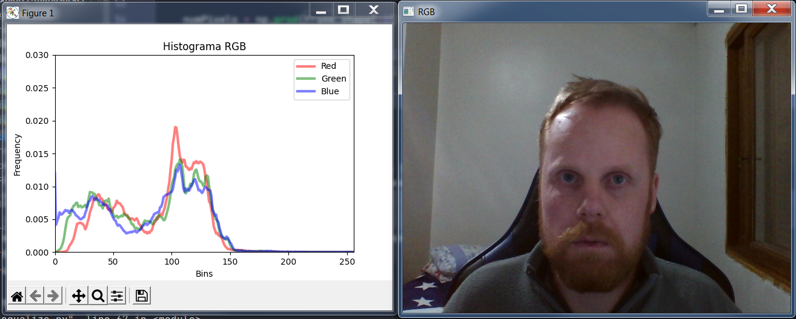
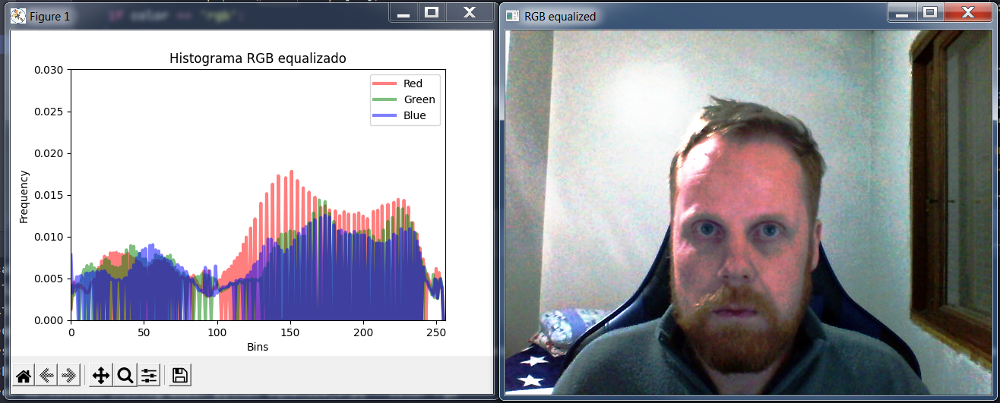

# Histogramas

## Requisitos
- Python 3.8
- OpenCV 4.5.3

## 4.2 Exercícios
Utilizando o programa exemplos/histogram.cpp como referência, implemente um programa equalize.cpp. Este deverá, para cada imagem capturada, realizar a equalização do histogram antes de exibir a imagem. Teste sua implementação apontando a câmera para ambientes com iluminações variadas e observando o efeito gerado. Assuma que as imagens processadas serão em tons de cinza.

## Programa Equalize.py
Desenvolvido em Python

## Exemplos de entrada e saída

<table>
    <tr>
        <th align="Center">Histograma RGB</th>
    </tr> 
    <tr>
        <td>
            
        </td>
    </tr>
</table>

<table>
    <tr>
        <th align="Center">Histograma RGB equalizado</th>
    </tr> 
    <tr>
        <td>
            
        </td>
    </tr>
</table>


## Funcionamento do código

Importação das bibliotecas
```
import numpy as np
import matplotlib.pyplot as plt
import argparse
import cv2
import time
```
\
Analisador de argumentos por linha de comando, usado para escolher se o vídeo será tratado em RGB ou CINZA, e ainda a quantidade de bins para plotar no gráfico do histograma.
```
parser = argparse.ArgumentParser()
parser.add_argument('-c', '--color', type=str, default='gray',
    help='Color space: "gray" (default), "rgb"')
parser.add_argument('-b', '--bins', type=int, default=256,
    help='Number of bins per channel (default 256)')
args = vars(parser.parse_args())

color = args['color']
bins = args['bins']
```
\
Prepara uma figura [fig] e um array de eixos [ax] para plotagem.
```
fig, ax = plt.subplots()
```
\
Verifica se o argumento passado por linha de comando foi RGB ou CINZA, para cada caso será inserido o título apropriado na plotagem.
```
if color == 'rgb':
    ax.set_title('Histograma RGB')
else:
    ax.set_title('Histograma escala de cinza')
```
\
Inserção dos labels nos eixos X e Y na plotagem.
```
ax.set_xlabel('Bins')
ax.set_ylabel('Frequency (N of Pixels)')
```
\
Verifica se o argumento passado por linha de comando foi RGB ou CINZA, se foi RGB é configurado um eixo para cada linha RGB. Se foi CINZA, apenas um eixo é configurado.\
Os parâmetros para configuração da função plot() são:\
np.arange(bins) -> um range com o tamanho dos bins\
np.zeros((bins, )) -> um array preenchido com zeros com o tamanho dos bins\
c = a cor
lw = largura da linha\
alpha = scalar
label = nome
```
lw = 3
alpha = 0.5
if color == 'rgb':
    lineR, = ax.plot(np.arange(bins), np.zeros((bins,)), c='r', lw=lw, alpha=alpha, label='Red')
    lineG, = ax.plot(np.arange(bins), np.zeros((bins,)), c='g', lw=lw, alpha=alpha, label='Green')
    lineB, = ax.plot(np.arange(bins), np.zeros((bins,)), c='b', lw=lw, alpha=alpha, label='Blue')
else:
    lineGray, = ax.plot(np.arange(bins), np.zeros((bins,1)), c='k', lw=lw, label='intensity')
```
\
Configura os limites dos eixos X e Y
```
ax.set_xlim(0, bins)
ax.set_ylim(0, bins + 50)
```
\
Torna a plotagem interativa com o plt.ion()
Faz a plotagem com o plt.show()
```
plt.ion()
plt.show()
```
\
Captura o vídeo da webcam.
```
capture = cv2.VideoCapture(0)
```
\
Início do loop infinito, até que a tecla 'q' seja pressionada.\
A cada iteração do while, captura cada frame e armazena em 'frame', e também uma condição booleana True ou False se existe frame em 'existe_frame'.\
Faz o flip do frame para inverter corrigindo a amostragem.\
Testa se não existir frame, sai do loop infinito e encerra a execução do programa.
```
while True:
    existe_frame, frame = capture.read()

    frame = cv2.flip(frame, 0)

    if not existe_frame:
        break
```
\
Testa se a cor é RGB.\
Se sim, faz um split do frame, separando em seus respectivos canais R G B.
```
    if color == 'rgb':
        (b, g, r) = cv2.split(frame)
```
\
Para cada canal, faz a equalização.
```
        b = cv2.equalizeHist(b)
        g = cv2.equalizeHist(g)
        r = cv2.equalizeHist(r)
```
\
Realiza o merge dos canais R G B em um único frame.\
Mostra o frame RGB equalizado.
```
        frame_equalized = cv2.merge((b, g, r))
        cv2.imshow('RGB equalized', frame_equalized)
```
\
Calcula o histograma para cada canal R G B
```
        histogramR = cv2.calcHist([r], [0], None, [bins], [0, 255])
        histogramG = cv2.calcHist([g], [0], None, [bins], [0, 255])
        histogramB = cv2.calcHist([b], [0], None, [bins], [0, 255])
```
\
Normaliza cada canal R G B individualmente, para melhorar a visualização da plotagem dos histogramas.
```
        cv2.normalize(histogramR, histogramR, 0, 255, cv2.NORM_MINMAX)
        cv2.normalize(histogramG, histogramG, 0, 255, cv2.NORM_MINMAX)
        cv2.normalize(histogramB, histogramB, 0, 255, cv2.NORM_MINMAX)
```
\
Para cada linha da plotagem, é carregado o histograma correspondente.
```
        lineR.set_ydata(histogramR)
        lineG.set_ydata(histogramG)
        lineB.set_ydata(histogramB)
```
\
Caso não for passado a cor de argumento por linha de comando, a execução cairá aqui, para tratamento do frame em escala de cinza.\
O frame é convertido para escala de cinza.
```
    else:
        gray = cv2.cvtColor(frame, cv2.COLOR_BGR2GRAY)
```
\
O frame em escala de cinza é equalizado e mostrado.
```
        frame_equalized = cv2.equalizeHist(gray)
        cv2.imshow('Grayscale equalized', frame_equalized)
```
\
Calculado o histograma.
```
        histogramGRAY = cv2.calcHist([frame_equalized], [0], None, [bins], [0, 255])
```
\
Normaliza o canal cinza, para melhorar a visualização da plotagem.
```
        cv2.normalize(histogramGRAY, histogramGRAY, 0, 255, cv2.NORM_MINMAX)
```
\
Para a linha em escala de cinza, é carregado o seu histograma.
```
        lineGray.set_ydata(histogramGRAY)
```
\
Atualiza a plotagem automaticamente e limpa a plotagem antiga.
```
    fig.canvas.draw()
    fig.canvas.flush_events()
```
\
Aguarda um tempo para a próxima leitura.
```
    time.sleep(0.1)
```
\
Testa se a tecla pressionada foi 'q', se for encerra o loop infinito e o programa encerra sua execução.
```
    if cv2.waitKey(1) & 0xFF == ord('q'):
        break
```
\
Libera todos os recursos utilizados, fecha as janelas abertas e encerra o programa.
```
capture.release()
cv2.destroyAllWindows()
```

## Código completo em Python
```
import numpy as np
import matplotlib.pyplot as plt
import argparse
import cv2
import time

parser = argparse.ArgumentParser()
parser.add_argument('-c', '--color', type=str, default='gray',
    help='Color space: "gray" (default), "rgb"')
parser.add_argument('-b', '--bins', type=int, default=256,
    help='Number of bins per channel (default 256)')
args = vars(parser.parse_args())

color = args['color']
bins = args['bins']

fig, ax = plt.subplots()

if color == 'rgb':
    ax.set_title('Histograma RGB equalizado')
else:
    ax.set_title('Histograma escala de cinza equalizado')

ax.set_xlabel('Bins')
ax.set_ylabel('Frequency (N of Pixels)')

lw = 3
alpha = 0.5
if color == 'rgb':
    lineR, = ax.plot(np.arange(bins), np.zeros((bins,)), c='r', lw=lw, alpha=alpha, label='Red')
    lineG, = ax.plot(np.arange(bins), np.zeros((bins,)), c='g', lw=lw, alpha=alpha, label='Green')
    lineB, = ax.plot(np.arange(bins), np.zeros((bins,)), c='b', lw=lw, alpha=alpha, label='Blue')
else:
    lineGray, = ax.plot(np.arange(bins), np.zeros((bins,1)), c='k', lw=lw, label='intensity')

ax.set_xlim(0, bins)
ax.set_ylim(0, 0.03)
ax.legend()
plt.ion()
plt.show()

capture = cv2.VideoCapture(0)
while True:
    existe_frame, frame = capture.read()

    frame = cv2.flip(frame, 0)

    if not existe_frame:
        break

    numPixels = np.prod(frame.shape[:2])
    if color == 'rgb':
        (b, g, r) = cv2.split(frame)
        b = cv2.equalizeHist(b)
        g = cv2.equalizeHist(g)
        r = cv2.equalizeHist(r)
        frame_equalized = cv2.merge((b, g, r))
        cv2.imshow('RGB equalized', frame_equalized)
        histogramR = cv2.calcHist([r], [0], None, [bins], [0, 255]) / numPixels
        histogramG = cv2.calcHist([g], [0], None, [bins], [0, 255]) / numPixels
        histogramB = cv2.calcHist([b], [0], None, [bins], [0, 255]) / numPixels
        lineR.set_ydata(histogramR)
        lineG.set_ydata(histogramG)
        lineB.set_ydata(histogramB)

    else:
        gray = cv2.cvtColor(frame, cv2.COLOR_BGR2GRAY)
        frame_equalized = cv2.equalizeHist(gray)
        cv2.imshow('Grayscale equalized', frame_equalized)
        histogram = cv2.calcHist([frame_equalized], [0], None, [bins], [0, 255]) / numPixels
        lineGray.set_ydata(histogram)

    fig.canvas.draw()
    fig.canvas.flush_events()

    time.sleep(0.1)

    if cv2.waitKey(1) & 0xFF == ord('q'):
        break

capture.release()
cv2.destroyAllWindows()
```

## Código do exemplo em C++
```
#include <iostream>
#include <opencv2/opencv.hpp>

int main(int argc, char** argv){
  cv::Mat image;
  int width, height;
  cv::VideoCapture cap;
  std::vector<cv::Mat> planes;
  cv::Mat histR, histG, histB;
  int nbins = 64;
  float range[] = {0, 255};
  const float *histrange = { range };
  bool uniform = true;
  bool acummulate = false;
  int key;

	cap.open(2);

  if(!cap.isOpened()){
    std::cout << "cameras indisponiveis";
    return -1;
  }

  cap.set(cv::CAP_PROP_FRAME_WIDTH, 640);
  cap.set(cv::CAP_PROP_FRAME_HEIGHT, 480);
  width = cap.get(cv::CAP_PROP_FRAME_WIDTH);
  height = cap.get(cv::CAP_PROP_FRAME_HEIGHT);

  std::cout << "largura = " << width << std::endl;
  std::cout << "altura  = " << height << std::endl;

  int histw = nbins, histh = nbins/2;
  cv::Mat histImgR(histh, histw, CV_8UC3, cv::Scalar(0,0,0));
  cv::Mat histImgG(histh, histw, CV_8UC3, cv::Scalar(0,0,0));
  cv::Mat histImgB(histh, histw, CV_8UC3, cv::Scalar(0,0,0));

  while(1){
    cap >> image;
    cv::split (image, planes);
    cv::calcHist(&planes[0], 1, 0, cv::Mat(), histR, 1,
                 &nbins, &histrange,
                 uniform, acummulate);
    cv::calcHist(&planes[1], 1, 0, cv::Mat(), histG, 1,
                 &nbins, &histrange,
                 uniform, acummulate);
    cv::calcHist(&planes[2], 1, 0, cv::Mat(), histB, 1,
                 &nbins, &histrange,
                 uniform, acummulate);

    cv::normalize(histR, histR, 0, histImgR.rows, cv::NORM_MINMAX, -1, cv::Mat());
    cv::normalize(histG, histG, 0, histImgG.rows, cv::NORM_MINMAX, -1, cv::Mat());
    cv::normalize(histB, histB, 0, histImgB.rows, cv::NORM_MINMAX, -1, cv::Mat());

    histImgR.setTo(cv::Scalar(0));
    histImgG.setTo(cv::Scalar(0));
    histImgB.setTo(cv::Scalar(0));

    for(int i=0; i<nbins; i++){
      cv::line(histImgR,
               cv::Point(i, histh),
               cv::Point(i, histh-cvRound(histR.at<float>(i))),
               cv::Scalar(0, 0, 255), 1, 8, 0);
      cv::line(histImgG,
               cv::Point(i, histh),
               cv::Point(i, histh-cvRound(histG.at<float>(i))),
               cv::Scalar(0, 255, 0), 1, 8, 0);
      cv::line(histImgB,
               cv::Point(i, histh),
               cv::Point(i, histh-cvRound(histB.at<float>(i))),
               cv::Scalar(255, 0, 0), 1, 8, 0);
    }
    histImgR.copyTo(image(cv::Rect(0, 0       ,nbins, histh)));
    histImgG.copyTo(image(cv::Rect(0, histh   ,nbins, histh)));
    histImgB.copyTo(image(cv::Rect(0, 2*histh ,nbins, histh)));
    cv::imshow("image", image);
    key = cv::waitKey(30);
    if(key == 27) break;
  }
  return 0;
}
```