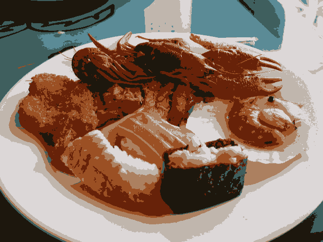

# k-means

## Requisitos
- Python 3.8
- OpenCV 4.5.3
- Numpy

## 9.2 Exercícios
- Utilizando o programa kmeans.cpp como exemplo prepare um programa exemplo onde a execução do código se dê usando o parâmetro nRodadas=1 e inciar os centros de forma aleatória usando o parâmetro KMEANS_RANDOM_CENTERS ao invés de KMEANS_PP_CENTERS. Realize 10 rodadas diferentes do algoritmo e compare as imagens produzidas. Explique porque elas podem diferir tanto.


## Programa cannypoints.py
Desenvolvido em Python

## Descrição
Lorem ipsum......

## Exemplos de entrada e saída

Imagem original          |
:-----------------------:|
 | 

Rodada 1                  |      Rodada 2             |
:------------------------:|:-------------------------:|
  |   |

Rodada 3                  |      Rodada 4             |
:------------------------:|:-------------------------:|
  |   |

Rodada 5                  |      Rodada 6             |
:------------------------:|:-------------------------:|
  |   |

Rodada 7                  |      Rodada 8             |
:------------------------:|:-------------------------:|
  |   |

Rodada 9                  |      Rodada 10            |
:------------------------:|:-------------------------:|
  |  |


    
    
# Funcionamento do código

Importação das bibliotecas.
```
import cv2
import numpy as np
```
\


## Conclusão
Lorem ipsum....


## Código final completo em Python
```
import cv2
import numpy as np

NCLUSTERS = 8
NROUNDS = 1

image = cv2.imread("resources/sushi.png", cv2.IMREAD_COLOR)

samples = image.reshape((-1, 3))
samples = np.float32(samples)

ret, labels, centers = cv2.kmeans(samples,
                                  NCLUSTERS,
                                  None,
                                  (cv2.TERM_CRITERIA_MAX_ITER | cv2.TERM_CRITERIA_EPS, 10000, 0.0001),
                                  NROUNDS,
                                  cv2.KMEANS_RANDOM_CENTERS)

centers = np.uint8(centers)
res = centers[labels.flatten()]
res2 = res.reshape((image.shape))

cv2.imshow("k-means", res2)
cv2.imwrite("output/k-means.png", res2)
cv2.waitKey(0)
cv2.destroyAllWindows()
```
-------------------------------------------------------

## Código do exemplo em C++
kmeans.cpp
```
#include <opencv2/opencv.hpp>
#include <cstdlib>

using namespace cv;

int main( int argc, char** argv ){
  int nClusters = 8;
  Mat rotulos;
  int nRodadas = 5;
  Mat centros;

  if(argc!=3){
	exit(0);
  }

  Mat img = imread( argv[1], CV_LOAD_IMAGE_COLOR);
  Mat samples(img.rows * img.cols, 3, CV_32F);

  for( int y = 0; y < img.rows; y++ ){
    for( int x = 0; x < img.cols; x++ ){
      for( int z = 0; z < 3; z++){
        samples.at<float>(y + x*img.rows, z) = img.at<Vec3b>(y,x)[z];
	  }
	}
  }

  kmeans(samples,
		 nClusters,
		 rotulos,
		 TermCriteria(CV_TERMCRIT_ITER|CV_TERMCRIT_EPS, 10000, 0.0001),
		 nRodadas,
		 KMEANS_PP_CENTERS,
		 centros );


  Mat rotulada( img.size(), img.type() );
  for( int y = 0; y < img.rows; y++ ){
    for( int x = 0; x < img.cols; x++ ){
	  int indice = rotulos.at<int>(y + x*img.rows,0);
	  rotulada.at<Vec3b>(y,x)[0] = (uchar) centros.at<float>(indice, 0);
	  rotulada.at<Vec3b>(y,x)[1] = (uchar) centros.at<float>(indice, 1);
	  rotulada.at<Vec3b>(y,x)[2] = (uchar) centros.at<float>(indice, 2);
	}
  }
  imshow( "clustered image", rotulada );
  imwrite(argv[2], rotulada);
  waitKey( 0 );
}
```

