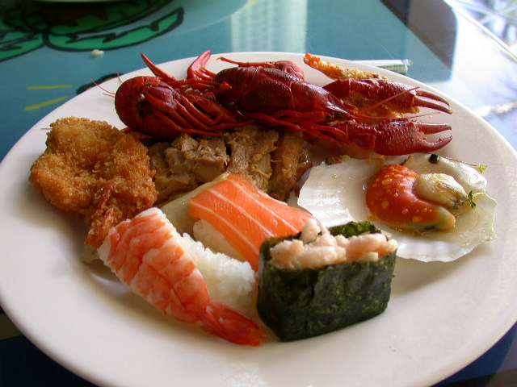

# k-means

## Sumário
1.  [Requisitos](#requisitos)
2.  [Exercícios](#exercícios)
3.  [Funcionamento do código](#funcionamento-do-código)
4.  [Conclusão](#conclusão)
5.  [Exemplos de entrada e saída](#exemplos-de-entrada-e-saída)
6.  [Código final completo em Python](#código-final-completo-em-python)
7.  [Código do exemplo em C plus plus](#código-do-exemplo-em-c-plus-plus)

-----------------------------------------------------

## Requisitos
- Python 3.8
- OpenCV 4.5.3
- Numpy

-----------------------------------------------------

## Exercícios
- Utilizando o programa kmeans.cpp como exemplo prepare um programa exemplo onde a execução do código se dê usando o parâmetro nRodadas=1 e inciar os centros de forma aleatória usando o parâmetro KMEANS_RANDOM_CENTERS ao invés de KMEANS_PP_CENTERS. Realize 10 rodadas diferentes do algoritmo e compare as imagens produzidas. Explique porque elas podem diferir tanto.

-----------------------------------------------------

## Funcionamento do código cannypoints.py

Importação das bibliotecas.
```
import cv2
import numpy as np
```
\
```NCLUSTRES = 8``` Configuração do número de clusters para o agrupamento do k-means, neste caso foram escolhidos 8 clusters, representando imagens de saída com 8 cores, um número maior de clusters gera um aimagem de saída com mais cores, e um número menor de clusters gera uma imagem de saída com menos cores.\
```NROUNDS = 1``` Configuração das rodadas para ser apenas uma vez, o propósito deste trabalho é realizar 10 rodadas individuais.
```
NCLUSTERS = 8
NROUNDS = 1
```
\
Leitura da imagem que será usada para aplicação do algoritmo.
```
image = cv2.imread("resources/sushi.png", cv2.IMREAD_COLOR)
```
\
Criação de uma matriz de amostras, para armazenar todas as cores dos pixels da imagem. A matriz samples possui um total de linhas igual ao total de pixels da imagem fornecida e apenas três colunas. Cada coluna é concebida para armazenar cada uma das componentes de cor (R, G, B) dos pixels.
```
samples = image.reshape((-1, 3))
```
Abaixo está o resultado da impressão da matriz samples com valores inteiros. A impressão no terminal informa o tamanho da matriz, sendo 307200 que equivale a totalidade dos pixes da imagem, o tipo da matriz numpy.ndarray, e os valores da primeira e última posição da matriz, onde é possível visualizar as componentes (R, G, B).


\
Transformação dos valores inteiros da matriz samples em valores float. Valores inteiros podem afetar o cálculo do k-means .
```
samples = np.float32(samples)
```
Abaixo está o resultado da impressão da matriz samples com valores float. A impressão no terminal informa o tamanho da matriz, sendo 307200 que equivale a totalidade dos pixes da imagem, o tipo da matriz numpy.ndarray, e os valores da primeira e última posição da matriz, onde é possível visualizar as componentes (R, G, B).


\
A função kmeans retorna 3 resultados, dos quais usaremos apenas rótulos (labels) e centros (centers). Rótulos é como cada amostra de "amostras" é rotulada, de 0 a NCLUSTERS, e os centros é onde cada rótulo está centralizado no espaço. Os critérios que passamos são os critérios para interromper o algoritmo (tipo de terminação, n iterações, precisão).\
Para o tipo de terminação, usamos cv2.TERM_CRITERIA_MAX_ITER | CV2.TERM_CRITERIA_EPS, o que significa que queremos que o algoritmo pare se a precisão for alcançada ou se o número de iterações tiver sido alcançado.\
Para o argumento flags foi passado KMEANS_RANDOM_CENTERS, que seleciona os centros iniciais de forma aleatória em cada tentativa.
```
ret, labels, centers = cv2.kmeans(samples,
                                  NCLUSTERS,
                                  None,
                                  (cv2.TERM_CRITERIA_MAX_ITER | cv2.TERM_CRITERIA_EPS, 10000, 0.0001),
                                  NROUNDS,
                                  cv2.KMEANS_RANDOM_CENTERS)
```
Abaixo está o resultado da impressão dos rótulos "labels". A impressão no terminal informa o tamanho da matriz, sendo 307200 que equivale a totalidade dos pixes da imagem, o tipo da matriz numpy.ndarray, e os valores da primeira e última posição da matriz, onde é possível visualizar os rótulos de cada pixel.


\
Abaixo está o resultado da impressão dos centros "centers". A impressão no terminal informa o tamanho da matriz, sendo 8 que equivale a NCLUSTERS, o tipo da matriz numpy.ndarray, e os valores onde é possível visualizar os centros de cada rótulo.


\
Transformação dos centros para valores inteiros, afim de criar uma nova imagem.
```
centers = np.uint8(centers)
```


\
Criação de uma matriz a partir dos centros e rótulos obtidos na execução do k-means.
```
res = centers[labels.flatten()]
```


\
Realizando o reshape da matriz, para que a imagem resultante tenha o mesmo shape da imagem original.
```
res = res.reshape((image.shape))
```


\
Mostra da imagem resultante em tela, gravação da imagem resultante em disco, e espera até que uma tecla seja pressionada para fechar a janela e encerrar a execução do programa.
```
cv2.imshow("k-means", res)
cv2.imwrite("output/k-means.png", res)
cv2.waitKey(0)
cv2.destroyAllWindows()
```


-----------------------------------------------------

## Conclusão
Quando o programa é executado, usando o parâmetro ```cv2.KMEANS_RANDOM_CENTERS```, esperamos que os resultados mudem a cada nova rodada, pois os centros inicializados aleatoriamente irão gerar diferentes amostras no espaço para cada execução, e criarão dados de clusters diferentes. Por este motivo, na quantização da imagem perceptiva, a imagem resultante deveria ser colorida de forma diferente a cada rodada.\
No entato, não foi este o resultado observado na prática. O algoritmo não mostrou nenhuma aleatoriedade nos resultados quando aplicado o parâmetro ```cv2.KMEANS_RANDOM_CENTERS```. Não localizei informações suficientes que explicassem o problema ou algo diferente à se fazer.
Existem muitas cores na imagem original e elas devem ser agrupadas de maneira diferente para diferentes execuções, foram realizadas diversas execuções, mas nenhuma aleatoriedade foi obtida.\
Para fins de teste, foi aumentado o número de clusters, de forma que talvez quanto mais fronteiras tivesse, o algoritmo poderia ter resultados diferentes; e também foi reduzida a precisão nos critérios de parada, mas nada mostrou aleatoriedade nos resultados.
Talvez esta falta de aleatoriedade se deve à falhas na implementação da biblioteca ou na sua documentação oficial online.\
\
Todas as execuções geraram sempre o mesmo array de centros, como pode ser visto na imagem abaixo, ou seja, não houve nenhuma aleatoriedade nas diversas execuções.


-----------------------------------------------------

## Exemplos de entrada e saída

Imagem original           |
:------------------------:|
  | 

Rodada 1                  |      Rodada 2             |
:------------------------:|:-------------------------:|
    |     |

Rodada 3                  |      Rodada 4             |
:------------------------:|:-------------------------:|
    |     |

Rodada 5                  |      Rodada 6             |
:------------------------:|:-------------------------:|
    |     |

Rodada 7                  |      Rodada 8             |
:------------------------:|:-------------------------:|
    |     |

Rodada 9                  |      Rodada 10            |
:------------------------:|:-------------------------:|
    |    |


Imagem original           |
:------------------------:|
   | 

Rodada 1                  |      Rodada 2             |
:------------------------:|:-------------------------:|
     |      |

Rodada 3                  |      Rodada 4             |
:------------------------:|:-------------------------:|
     |      |

Rodada 5                  |      Rodada 6             |
:------------------------:|:-------------------------:|
     |      |

Rodada 7                  |      Rodada 8             |
:------------------------:|:-------------------------:|
     |      |

Rodada 9                  |      Rodada 10            |
:------------------------:|:-------------------------:|
     |     |


Imagem original           |
:------------------------:|
 | 

Rodada 1                  |      Rodada 2             |
:------------------------:|:-------------------------:|
   |    |

Rodada 3                  |      Rodada 4             |
:------------------------:|:-------------------------:|
   |    |

Rodada 5                  |      Rodada 6             |
:------------------------:|:-------------------------:|
   |    |

Rodada 7                  |      Rodada 8             |
:------------------------:|:-------------------------:|
   |    |

Rodada 9                  |      Rodada 10            |
:------------------------:|:-------------------------:|
   |   |


Imagem original           |
:------------------------:|
 | 

Rodada 1                  |      Rodada 2             |
:------------------------:|:-------------------------:|
   |    |

Rodada 3                  |      Rodada 4             |
:------------------------:|:-------------------------:|
   |    |

Rodada 5                  |      Rodada 6             |
:------------------------:|:-------------------------:|
   |    |

Rodada 7                  |      Rodada 8             |
:------------------------:|:-------------------------:|
   |    |

Rodada 9                  |      Rodada 10            |
:------------------------:|:-------------------------:|
   |   |

-----------------------------------------------------

## Código final completo em Python
```
import cv2
import numpy as np

NCLUSTERS = 8
NROUNDS = 1

image = cv2.imread("resources/sushi.png", cv2.IMREAD_COLOR)

samples = image.reshape((-1, 3))
samples = np.float32(samples)

ret, labels, centers = cv2.kmeans(samples,
                                  NCLUSTERS,
                                  None,
                                  (cv2.TERM_CRITERIA_MAX_ITER | cv2.TERM_CRITERIA_EPS, 10000, 0.0001),
                                  NROUNDS,
                                  cv2.KMEANS_RANDOM_CENTERS)

centers = np.uint8(centers)
res = centers[labels.flatten()]
res = res.reshape((image.shape))

cv2.imshow("k-means", res)
cv2.imwrite("output/k-means.png", res)
cv2.waitKey(0)
cv2.destroyAllWindows()
```
-------------------------------------------------------

## Código do exemplo em C plus plus
kmeans.cpp
```
#include <opencv2/opencv.hpp>
#include <cstdlib>

using namespace cv;

int main( int argc, char** argv ){
  int nClusters = 8;
  Mat rotulos;
  int nRodadas = 5;
  Mat centros;

  if(argc!=3){
	exit(0);
  }

  Mat img = imread( argv[1], CV_LOAD_IMAGE_COLOR);
  Mat samples(img.rows * img.cols, 3, CV_32F);

  for( int y = 0; y < img.rows; y++ ){
    for( int x = 0; x < img.cols; x++ ){
      for( int z = 0; z < 3; z++){
        samples.at<float>(y + x*img.rows, z) = img.at<Vec3b>(y,x)[z];
	  }
	}
  }

  kmeans(samples,
		 nClusters,
		 rotulos,
		 TermCriteria(CV_TERMCRIT_ITER|CV_TERMCRIT_EPS, 10000, 0.0001),
		 nRodadas,
		 KMEANS_PP_CENTERS,
		 centros );


  Mat rotulada( img.size(), img.type() );
  for( int y = 0; y < img.rows; y++ ){
    for( int x = 0; x < img.cols; x++ ){
	  int indice = rotulos.at<int>(y + x*img.rows,0);
	  rotulada.at<Vec3b>(y,x)[0] = (uchar) centros.at<float>(indice, 0);
	  rotulada.at<Vec3b>(y,x)[1] = (uchar) centros.at<float>(indice, 1);
	  rotulada.at<Vec3b>(y,x)[2] = (uchar) centros.at<float>(indice, 2);
	}
  }
  imshow( "clustered image", rotulada );
  imwrite(argv[2], rotulada);
  waitKey( 0 );
}
```

