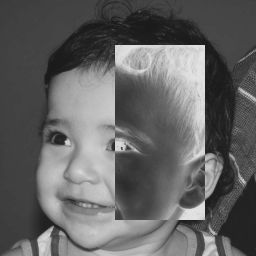
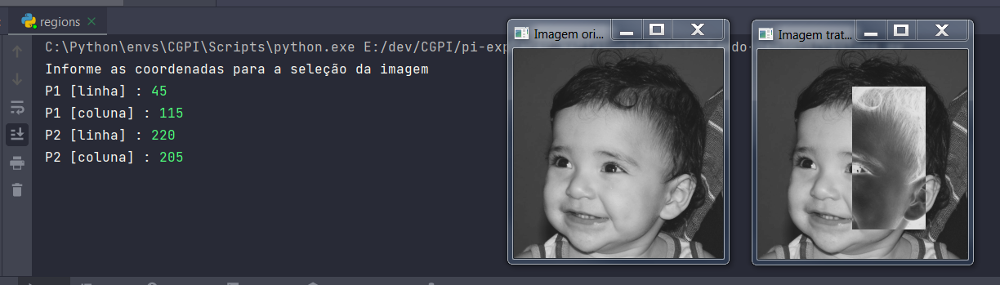
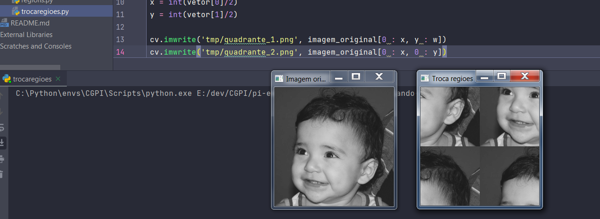

# Manipulando imagens

## Requisitos
- Python 3.8
- OpenCV 4.5.3

## Regions
Implementar um programa regions.py. Esse programa deverá solicitar ao usuário as coordenadas de dois pontos P1 e P2 localizados dentro dos limites do tamanho da imagem e exibir que lhe for fornecida. Entretanto, a região definida pelo retângulo de vértices opostos definidos pelos pontos P1 e P2 será exibida com o negativo da imagem na região correspondente. O efeito é ilustrado na figura a seguir.

<table>
    <tr>
        <th align="Center">Imagem original</th>
        <th align="Center">Imagem manipulada</th>
    </tr> 
    <tr>
        <td>
            
        </td>
        <td>
            
        </td>
    </tr>
</table>

## Funcionamento do código

Importação da biblioteca OpenCV
```
import cv2 as cv
```

Carregando a imagem original para uma variável e realizando uma cópia da mesma.
O conteúdo da variável "imagem_original" será mantido para exibição posterior.
O conteúdo da variável "imagem_tratada" será alterado para cumprir com o objetivo do progama.

```
imagem_original = cv.imread('resources/imagem.png')
imagem_tratada = imagem_original.copy()
```

Entrada de console para o usuário informar as coordenadas de dois pontos P1 e P2.
Cada ponto terá duas informações, linha e coluna.
```
print("Informe as coordenadas para a seleção da imagem")
linha_inicio = int(input("P1 [linha] : "))
coluna_inicio = int(input("P1 [coluna] : "))

linha_fim = int(input("P2 [linha] : "))
coluna_fim = int(input("P2 [coluna] : "))
```

Com base nos pontos informados, neste ponto é extraída a região de interesse da imagem "roi" (region of interest).
```
roi = imagem_tratada[linha_inicio:linha_fim, coluna_inicio:coluna_fim]
```

Tendo a região de interessea,  agora realizamos a negativa desta imagem, invertendo os bits "on" em "off", através da função bitwise_not da biblioteca OpenCV.
```
roi_negativa = cv.bitwise_not(crop)
```

Agora com a região de interesse negativa, adicionamos ela na mesma imagem em que foi extraída, utilizando os mesmos pontos informados pelo usuário.
```
imagem_tratada[linha_inicio:linha_fim, coluna_inicio:coluna_fim] = roi_negativa
```

Salvamos a imagem tratada.
```
cv.imwrite('output/regions.png', imagem_tratada)
```

Imprimimos a imagem original e a imagem tratada para comparação.
```
cv.imshow('Imagem original', imagem_original)
cv.imshow('Imagem tratada', imagem_tratada)
```

Função para o programa aguardar o fim da execução quando uma tecla for pressionada.
```
cv.waitKey(0)
```

## Exemplo de entrada
O usuário digitou para o ponto P1 45 e 115 correspondendo à linha e coluna respectivamente, e digitou para o ponto P2 220 e 205 correspondendo à linha e coluna respectivamente.
O resultado foi transformar a área de interesse selecionada na negativa da imagem, conforme mostra a imagem abaixo.

<table>
    <tr>
        <th align="Center">Exemplo de entrada e a saída resultante</th>
    </tr> 
    <tr>
        <td>
            
        </td>
    </tr>
</table>

## Código
```
import cv2 as cv

imagem_original = cv.imread('resources/imagem.png')
imagem_tratada = imagem_original.copy()

print("Informe as coordenadas para a seleção da imagem")
linha_inicio = int(input("P1 [linha] : "))
coluna_inicio = int(input("P1 [coluna] : "))

linha_fim = int(input("P2 [linha] : "))
coluna_fim = int(input("P2 [coluna] : "))

roi = imagem_tratada[linha_inicio:linha_fim, coluna_inicio:coluna_fim]

roi_negativa = cv.bitwise_not(roi)

imagem_tratada[linha_inicio:linha_fim, coluna_inicio:coluna_fim] = roi_negativa

cv.imwrite('output/regions.png', imagem_tratada)

cv.imshow('Imagem original', imagem_original)
cv.imshow('Imagem tratada', imagem_tratada)

cv.waitKey(0)
```

-------------------------------------------------------------------------------------------------------------------------------------------------------------

## Troca Regiões
Implementar um programa trocaregioes.py. Seu programa deverá trocar os quadrantes em diagonal na imagem. Explore o uso da classe Mat e seus construtores para criar as regiões que serão trocadas. O efeito é ilustrado na figura a seguir.

<table>
    <tr>
        <th align="Center">Imagem original</th>
        <th align="Center">Imagem manipulada</th>
    </tr> 
    <tr>
        <td>
            
        </td>
        <td>
            
        </td>
    </tr>
</table>

## Funcionamento do código

Importação da biblioteca OpenCV
```
import cv2 as cv
```

Carregando a imagem original para uma variável e realizando uma cópia da mesma.
O conteúdo da variável "imagem_original" será mantido para exibição posterior.
O conteúdo da variável "imagem_tratada" será alterado para cumprir com o objetivo do progama.
```
imagem_original = cv.imread('resources/imagem.png')
imagem_tratada = imagem_original.copy()
```

Usando a função shape sobre a imagem para extrair a suas features, com essa função é possível extrair em um vetor as informações do tamanho da largura e altura da imagem.
A primeira posição do vetor (vetor[0]) será a largura da imagem, a segunda posição do vetor (vetor[1]) será a altura da imagem, ambas as informações são salvas nas variáveis "w' e "h".
Para descobrir o ponto médio, ou seja, o meio da imagem, pode-se dividir os valores das variáveis w e h por dois, e salvar os resultados em outas duas variáveis "x" e "y".
O ponto médio será essencial para dividir a imagem em quatro quadrantes.
```
vetor = imagem_original.shape
w = int(vetor[0])
h = int(vetor[1])
x = int(vetor[0]/2)
y = int(vetor[1]/2)
```

Dividindo a imagem em quatro quadrantes, e salvando cada quadrante de imagem. Neste caso é utilizado as variáveis "w", "h", "x" e "y" para selecionar as áreas de interesse em quatro quadrantes.
```
cv.imwrite('tmp/quadrante_1.png', imagem_original[0 : x, y : w])
cv.imwrite('tmp/quadrante_2.png', imagem_original[0 : x, 0 : y])
cv.imwrite('tmp/quadrante_3.png', imagem_original[x : h, 0 : y])
cv.imwrite('tmp/quadrante_4.png', imagem_original[x : h, y : w])
```

Inserindo os quadrantes de imagem trocando as diagonais.
```
imagem_tratada[0 : x, y : w] = cv.imread('tmp/quadrante_3.png')
imagem_tratada[0 : x, 0 : y] = cv.imread('tmp/quadrante_4.png')
imagem_tratada[x : h, 0 : y] = cv.imread('tmp/quadrante_1.png')
imagem_tratada[x : h, y : w] = cv.imread('tmp/quadrante_2.png')
```

Salvamos a imagem tratada, já com as diagonais trocadas.
```
cv.imwrite('output/trocaregioes.png', imagem_tratada)
```

Imprimimos a imagem original e a imagem tratada para comparação.
```
cv.imshow('Imagem original', imagem_original)
cv.imshow('Troca regioes', imagem_tratada)
```

Função para o programa aguardar o fim da execução quando uma tecla for pressionada.
```
cv.waitKey(0)
```

## Exemplo de funcionamento

<table>
    <tr>
        <th align="Center">Exemplo de entrada e a saída resultante</th>
    </tr> 
    <tr>
        <td>
            
        </td>
    </tr>
</table>

## Código
```
import cv2 as cv

# Carregando a imagem
imagem_original = cv.imread('resources/imagem.png')
imagem_tratada = imagem_original.copy()

vetor = imagem_original.shape
w = int(vetor[0])
h = int(vetor[1])
x = int(vetor[0]/2)
y = int(vetor[1]/2)

cv.imwrite('tmp/quadrante_1.png', imagem_original[0 : x, y : w])
cv.imwrite('tmp/quadrante_2.png', imagem_original[0 : x, 0 : y])
cv.imwrite('tmp/quadrante_3.png', imagem_original[x : h, 0 : y])
cv.imwrite('tmp/quadrante_4.png', imagem_original[x : h, y : w])

imagem_tratada[0 : x, y : w] = cv.imread('tmp/quadrante_3.png')
imagem_tratada[0 : x, 0 : y] = cv.imread('tmp/quadrante_4.png')
imagem_tratada[x : h, 0 : y] = cv.imread('tmp/quadrante_1.png')
imagem_tratada[x : h, y : w] = cv.imread('tmp/quadrante_2.png')

cv.imwrite('output/trocaregioes.png', imagem_tratada)

cv.imshow('Imagem original', imagem_original)
cv.imshow('Troca regioes', imagem_tratada)

cv.waitKey(0)
```

