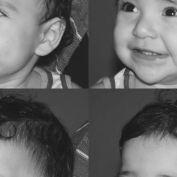

# Manipulando imagens

## Regions
implementar um programa regions.py. Esse programa deverá solicitar ao usuário as coordenadas de dois pontos P1 e P2 localizados dentro dos limites do tamanho da imagem e exibir que lhe for fornecida. Entretanto, a região definida pelo retângulo de vértices opostos definidos pelos pontos P1 e P2 será exibida com o negativo da imagem na região correspondente. O efeito é ilustrado na figura a seguir.

<table>
    <tr>
        <th>
            
            
        </th>
    </tr>
</table>

## Troca Regiões
Implementar um programa trocaregioes.cpp. Seu programa deverá trocar os quadrantes em diagonal na imagem. Explore o uso da classe Mat e seus construtores para criar as regiões que serão trocadas. O efeito é ilustrado na Figura 5.

<table>
    <tr>
        <th>
            
            
        </th>
    </tr>
</table>