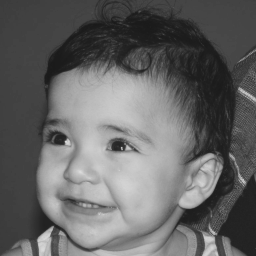

#Manipulando imagens

##Regions
implementar um programa regions.py. Esse programa deverá solicitar ao usuário as coordenadas de dois pontos P1 e P2 localizados dentro dos limites do tamanho da imagem e exibir que lhe for fornecida. Entretanto, a região definida pelo retângulo de vértices opostos definidos pelos pontos P1 e P2 será exibida com o negativo da imagem na região correspondente. O efeito é ilustrado na figura a seguir.

##Troca Regiões