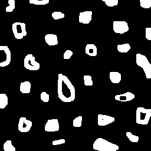
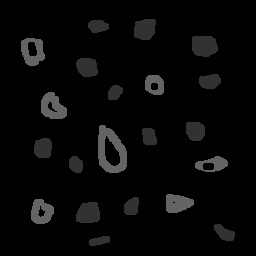

# Preenchimentos

## Requisitos
- Python 3.8
- OpenCV 4.5.3

## 3.2 Exercícios
Observando-se o programa labeling.cpp como exemplo, é possível verificar que caso existam mais de 255 objetos na cena, o processo de rotulação poderá ficar comprometido. Identifique a situação em que isso ocorre e proponha uma solução para este problema.

### Resposta
Se existir mais de 255 objetos na cena, o processo de rotulação ficará comprometido, porque estamos trabalhando com a imagem em tons de cinza, os tons de cinza variam de 0 à 255 e contém apenas um canal, não sendo possível criar rótulos únicos diferente destes valores.

Para solucionar este problema, precisamos trabalhar com a imagem em formato RGB, o formato RGB possui 3 canais ((0 à 255), (0 à 255), (0 à 255)), criando milhares de possibilidades para rotulação dos objetos encontrados na cena.
Caso a imagem recebida seja em escala de cinza, podemos utilizar uma função do OpenCV para converter de escala de cinza para o formato RGB.
A função para conversão é ```cv.COLOR_GRAY2BGR```, e um exemplo de aplicação em Python seria ```imagem_rgb = cv2.cvtColor(imagem_gray, cv.COLOR_GRAY2BGR)```


-------------------------------------------------------------------------------------------------------------------------------------------------------------

## 3.2 Exercícios
Aprimore o algoritmo de contagem apresentado para identificar regiões com ou sem buracos internos que existam na cena. Assuma que objetos com mais de um buraco podem existir. Inclua suporte no seu algoritmo para não contar bolhas que tocam as bordas da imagem. Não se pode presumir, a priori, que elas tenham buracos ou não.

<table>
    <tr>
        <th align="Center">Entrada imagem original</th>
        <th align="Center">Saída normal</th>
        <th align="Center">Saída aprimorada</th>
    </tr> 
    <tr>
        <td>
            
        </td>
        <td>
            
        </td>
        <td>
            
        </td>
    </tr>
</table>

## Funcionamento do código

Importação da biblioteca OpenCV
```
import cv2
```
Leitura da imagem
```
image = cv2.imread('resources/bolhas.png')
```
Transformação da imagem para escala de cinza
```
image_gray = cv2.cvtColor(image, cv2.COLOR_BGR2GRAY)
```
Cópia da imagem original
```
imagem_tratada = image_gray.copy()
```
Obtendo as dimensões da imagem: altura e largura.
```
height, width = image.shape[:2]
```
Ponto no qual será usdado como semente para utilizar a função floodFill
```
seedpoint = [0, 0]
```
Análise das bordas esquerda e direita, é realizado um laço ```for``` para iterar a altura da imagem, varrendo cada linha.
```
for i in range(height):
```

Eliminação de objetos na borda esquerda da cena, caso o pixel tenha o tom de cinza no valor de 255 (branco), este pixel e os pixels vizinhos são alterados para o tom de cinza no valor 0 (preto).
```
    if imagem_tratada[i, 0] == 255:
        seedpoint[0] = 0
        seedpoint[1] = i
        cv2.floodFill(imagem_tratada, None, seedpoint, 0)
```
Eliminação de objetos na borda direita da cena, caso o pixel tenha o tom de cinza no valor de 255 (branco), este pixel e os pixels vizinhos são alterados para o tom de cinza no valor 0 (preto).
```
    if imagem_tratada[i, width-1] == 255:
        seedpoint[0] = width-1
        seedpoint[1] = i
        cv2.floodFill(imagem_tratada, None, seedpoint, 0)
```

Análise das bordas superior e inferior, é realizado um laço ```for``` para iterar a largura da imagem, varrendo cada coluna.
```
for j in range(width):
```
Eliminação de objetos na borda superior da cena, caso o pixel tenha o tom de cinza no valor de 255 (branco), este pixel e os pixels vizinhos são alterados para o tom de cinza no valor 0 (preto).
```
    if imagem_tratada[0, j] == 255:
        seedpoint[0] = j
        seedpoint[1] = 0
        cv2.floodFill(imagem_tratada, None, seedpoint, 0)
```
Eliminação de objetos na borda inferior da cena, caso o pixel tenha o tom de cinza no valor de 255 (branco), este pixel e os pixels vizinhos são alterados para o tom de cinza no valor 0 (preto).
```
    if imagem_tratada[height-1, j] == 255:
        seedpoint[0] = j
        seedpoint[1] = height-1
        cv2.floodFill(imagem_tratada, None, seedpoint, 0)
```
A imagem em escala de cinza tem o fundo com o tom no valor 0, vamos alterar para 1 para diferenciar na busca por objetos com buracos, a alteração começa na posição (0, 0), para isso precisamos também alterar o seedpoint (semente).
```
seedpoint[0] = 0
seedpoint[1] = 0
cv2.floodFill(imagem_tratada, None, seedpoint, 1)
```
Identificando regiões com buracos, através de dois laçoes for aninhados, a imagem é percorrida, se o valor do pixel for 0, e o valor do pixel anterior for 255, significa que localizamos um objeto com buraco, então é necessário alterar o tom de cinza  deste objeto com buraco com valor 100, e contabilizar nosso contador de objetos com buracos.
```
nobjects_com_buracos = 0
for i in range(height):
    for j in range(width):
        if imagem_tratada[i, j] == 0:
            if imagem_tratada[i, j -1] == 255:
                nobjects_com_buracos += 1
                seedpoint[0] = j-1
                seedpoint[1] = i
                cv2.floodFill(imagem_tratada, None, seedpoint, 100)
```
Identificando regiões sem buracos, através de dois laçoes for aninhados, a imagem é percorrida, se o valor do pixel for 255, significa que localizamos um objeto sem buraco, então é necessário alterar o tom de cinza deste objeto sem buracos com valor 50, e contabilizar nosso contador de objetos sem buracos.
```
nobjects_sem_buracos = 0
for i in range(height):
    for j in range(width):
        if imagem_tratada[i, j] == 255:
            nobjects_sem_buracos += 1
            seedpoint[0] = j
            seedpoint[1] = i
            cv2.floodFill(imagem_tratada, None, seedpoint, 50)
```
Identificando regiões na imagem original, sem aprimoração. A imagem é percorrida, e caso um pixel for encontrado com valor = 255, significa que localizamos um objeto, então é necessário alterar o tom de cinza rotulando cada objeto conforme o valor da variável contador nobjects.
```
nobjects = 0
for i in range(height):
    for j in range(width):
        if image_gray[i, j] == 255:
            nobjects += 1
            seedpoint[0] = j
            seedpoint[1] = i
            cv2.floodFill(image_gray, None, seedpoint, nobjects)
```
Impressão da saída normal, sem aprimoração
```
cv2.imwrite('output/Saida-normal.PNG', image_gray)
cv2.imshow('Saida do programa labeling', image_gray)
print("A figura tem " + str(nobjects) + " objetos no total")
```
Impressão da saída do algoritmo aprimorado
```
cv2.imwrite('output/Saida-aprimorada.PNG', imagem_tratada)
cv2.imshow('Saida do programa labeling aprimorado', imagem_tratada)
print("A figura tem " + str(nobjects_sem_buracos) + " objetos sem buracos que não tocam as bordas da imagem")
print("A figura tem " + str(nobjects_com_buracos) + " objetos com buracos que não tocam as bordas da imagem")
```
Função para o programa aguardar o fim da execução quando uma tecla for pressionada.
```
cv2.waitKey(0)
```
## Exemplo de funcionamento

<table>
    <tr>
        <th align="Center">Entrada imagem original</th>
        <th align="Center">Saída normal</th>
        <th align="Center">Saída aprimorada</th>
    </tr> 
    <tr>
        <td>
            
        </td>
        <td>
            
        </td>
        <td>
            
        </td>
    </tr>
</table>

## Código já aprimorado
```
# importação da biblioteca OpenCV
import cv2

# Leitura da imagem
image = cv2.imread('resources/bolhas.png')

# Transformação da imagem para escala de cinza
image_gray = cv2.cvtColor(image, cv2.COLOR_BGR2GRAY)

# Cópia da imagem original
imagem_tratada = image_gray.copy()

# Obtendo as dimensões da imagem: altura e largura.
height, width = image.shape[:2]

# Ponto no qual será usdado como semente para utilizar a função floodFill
seedpoint = [0, 0]

# Análise das bordas esquerda e direita
for i in range(height):

    # Eliminação de objetos na borda esquerda da cena
    if imagem_tratada[i, 0] == 255:
        seedpoint[0] = 0
        seedpoint[1] = i
        cv2.floodFill(imagem_tratada, None, seedpoint, 0)

    # Eliminação de objetos na borda direita da cena
    if imagem_tratada[i, width-1] == 255:
        seedpoint[0] = width-1
        seedpoint[1] = i
        cv2.floodFill(imagem_tratada, None, seedpoint, 0)

# Análise das bordas superior e inferior
for j in range(width):

    # Eliminação de objetos na borda superior da cena
    if imagem_tratada[0, j] == 255:
        seedpoint[0] = j
        seedpoint[1] = 0
        cv2.floodFill(imagem_tratada, None, seedpoint, 0)

    # Eliminação de objetos na borda inferior da cena
    if imagem_tratada[height-1, j] == 255:
        seedpoint[0] = j
        seedpoint[1] = height-1
        cv2.floodFill(imagem_tratada, None, seedpoint, 0)

# A imagem em escala de cinza tem o fundo com o tom no valor 0,
# vamos alterar para 1 para diferenciar na busca por objetos com buracos
seedpoint[0] = 0
seedpoint[1] = 0
cv2.floodFill(imagem_tratada, None, seedpoint, 1)

# Identificando regiões com buracos
nobjects_com_buracos = 0
for i in range(height):
    for j in range(width):
        if imagem_tratada[i, j] == 0:
            if imagem_tratada[i, j -1] == 255:
                nobjects_com_buracos += 1
                seedpoint[0] = j-1
                seedpoint[1] = i
                cv2.floodFill(imagem_tratada, None, seedpoint, 100)

# Identificando regiões sem buracos
nobjects_sem_buracos = 0
for i in range(height):
    for j in range(width):
        if imagem_tratada[i, j] == 255:
            nobjects_sem_buracos += 1
            seedpoint[0] = j
            seedpoint[1] = i
            cv2.floodFill(imagem_tratada, None, seedpoint, 50)

# Identificando regiões na imagem original, sem aprimoração
nobjects = 0
for i in range(height):
    for j in range(width):
        if image_gray[i, j] == 255:
            nobjects += 1
            seedpoint[0] = j
            seedpoint[1] = i
            cv2.floodFill(image_gray, None, seedpoint, nobjects)

# Impressão da saída normal, sem aprimoração
cv2.imwrite('output/Saida-normal.PNG', image_gray)
cv2.imshow('Saida do programa labeling', image_gray)
print("A figura tem " + str(nobjects) + " objetos no total")

# Impressão da saída do algoritmo aprimorado
cv2.imwrite('output/Saida-aprimorada.PNG', imagem_tratada)
cv2.imshow('Saida do programa labeling aprimorado', imagem_tratada)
print("A figura tem " + str(nobjects_sem_buracos) + " objetos sem buracos que não tocam as bordas da imagem")
print("A figura tem " + str(nobjects_com_buracos) + " objetos com buracos que não tocam as bordas da imagem")

cv2.waitKey(0)

```
---------------------------------------------------------------------------------------------------------------------------------------------------

## Código original labeling.cpp em C++ 

```
#include <iostream>
#include <opencv2/opencv.hpp>

using namespace cv;

int main(int argc, char** argv){
  cv::Mat image, realce;
  int width, height;
  int nobjects;

  cv::Point p;
  image = cv::imread(argv[1], cv::IMREAD_GRAYSCALE);

  if(!image.data){
    std::cout << "imagem nao carregou corretamente\n";
    return(-1);
  }

  width=image.cols;
  height=image.rows;
  std::cout << width << "x" << height << std::endl;

  p.x=0;
  p.y=0;

  // busca objetos presentes
  nobjects=0;
  for(int i=0; i<height; i++){
    for(int j=0; j<width; j++){
      if(image.at<uchar>(i,j) == 255){
        // achou um objeto
        nobjects++;
        p.x=j;
        p.y=i;
  		// preenche o objeto com o contador
		  cv::floodFill(image,p,nobjects);
      }
    }
  }
  std::cout << "a figura tem " << nobjects << " bolhas\n";
  cv::equalizeHist(image, realce);
  cv::imshow("image", image);
  cv::imshow("realce", realce);
  cv::imwrite("labeling.png", image);
  cv::waitKey();
  return 0;
}
```
